The best way to learn Blender is by getting your hands dirty and working on a project. In this Beginner Blender tutorial series, you will model and animate a robot, create a simple scene and render a final video. You’ll be creating a simplified version of Invalid ID, the CG robot starring in the final episode of The Hello World Program.

<iframe allow="accelerometer; autoplay; encrypted-media; gyroscope; picture-in-picture" allowfullscreen="" class="arve-iframe fitvidsignore" name="" scrolling="no" src="https://www.youtube.com/embed/OKVQdPuwdYg" width="480" height="270" frameborder="0"></iframe>

And this is the robot, scene and animation you will be creating in this series:

<iframe allow="accelerometer; autoplay; encrypted-media; gyroscope; picture-in-picture" allowfullscreen="" class="arve-iframe fitvidsignore" name="" scrolling="no" src="https://www.youtube.com/embed/WfsHlpsa9Jg" width="480" height="270" frameborder="0"></iframe>

Let’s begin!

## Beginner Blender Tutorial: How to Model & Animate a Robot

To use Blender, you will need a keyboard with a numeric pad and a 3-button mouse with a scrolling wheel. If you haven’t already, download [Blender](https://www.blender.org/). This tutorial was created using version 2.77, but you should be okay with the latest release. After you start Blender, you will see the default setup below. The interface can be a bit intimidating at first, but don’t worry, it will all make sense in the end. The main panel is the 3D View. At the bottom is the Timeline. On the right are the Outliner and Properties.

When possible, I’ll be teaching you keyboard shortcuts, rather than selecting actions via menus. To get good and fast at Blender, you will want to know all the shortcuts, so why not start now? In this tutorial, keyboard and mouse actions will be displayed in **BOLD.** Shortcuts that read **NUM1, NUM2, NUM3,** etc. refer to the keys on the numeric pad. **LMB** and **RMB** refer to the Left Mouse Button and the Right Mouse Button. In a nutshell, the **LMB** is used to click buttons and the **RMB** is used to select objects. This will make sense later.

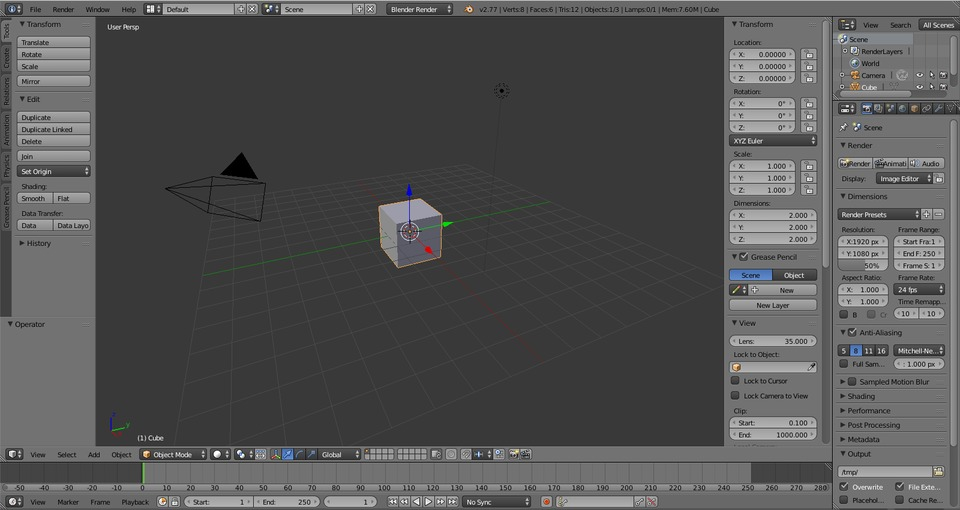

With your cursor in the 3D view panel, press **N** to open the Transform tab. This provides you information on, and allows you to enter values for, the position, rotation and scale of objects in your scene. We’ll be using it a lot later.

Now press **NUM1** to switch to front view and **NUM5** to switch to orthographic perspective.

See how the Cube is highlighted in orange? That means it’s the object currently selected.

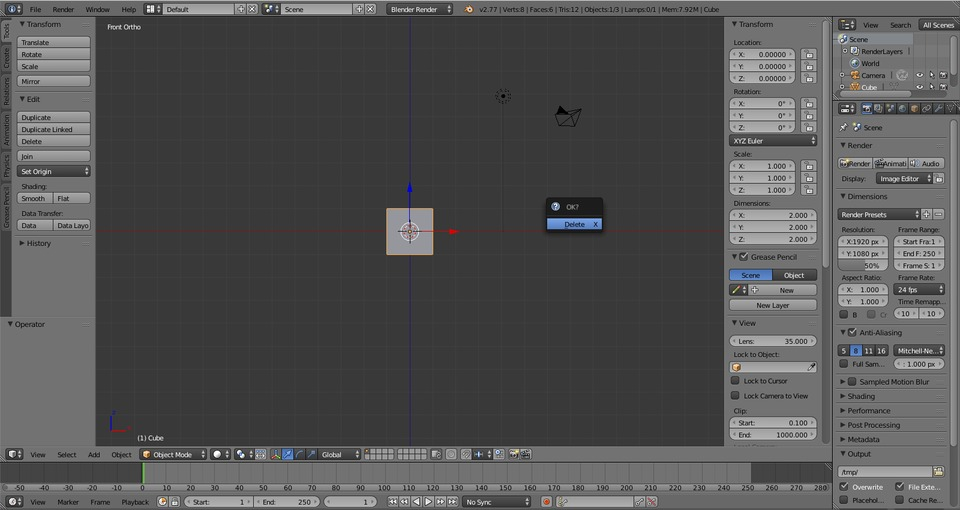

Press **X** to delete the Cube. A popup menu will ask you to confirm. Click with the **LMB** or press **ENTER.**  

Now that that’s out of the way, let’s build our robot. Press **SHIFT+A** to access the Add menu. Under Mesh, select Cylinder.

Zoom in with scroll wheel and press **Tab** to enter Edit Mode. In Edit Mode, you can see the points and lines that compose the Cylinder highlighted in orange. These points and lines are called _vertices_ and _edges_ and 3D objects composed of vertices and edges are called _meshes_.  
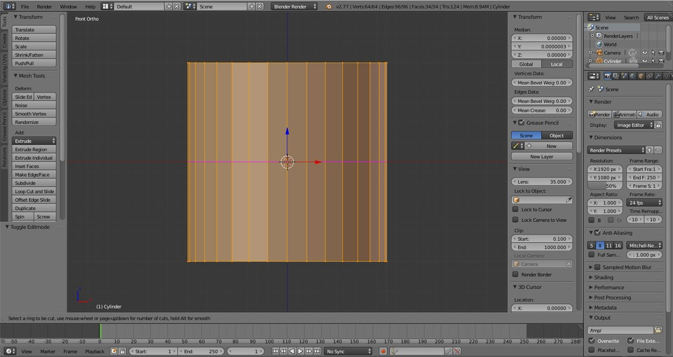

With your mouse hovering over the Cylinder, press **CTRL+R** to access the Loop Cut and Slide tool. You will see a violet line appear around the center of the Cylinder.  

Press **2** to create two loops, and hit **ENTER** twice, once to confirm two loops and twice to confirm placement.

**CTRL + TAB** opens the Mesh Select Mode menu. Select Edge.  

**ALT + SHIFT + RMB** to select the lower loop.

Press **S** to Scale and type **1.1**, then press **ENTER.**

Select an edge on the upper loop and press **ALT + SHIFT + RMB** to select all of the edges in the loop.

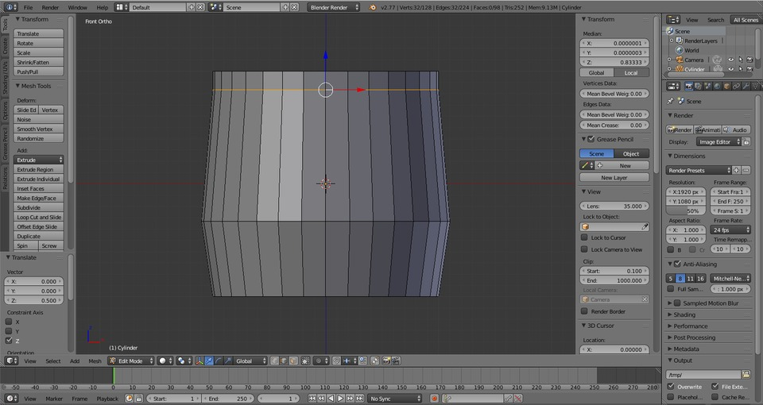

With the edge loop selected, press **G** to Grab it, **Z** to move it only on the Z-axis and type in **.5\.** Press **ENTER**.

**CTRL + TAB** and select Face.

**ALT + SHIFT + RMB** to select the upper loop of faces.

Press **S** to Scale and enter .9, then press **ENTER** to confirm.

Press **NUM7** to switch to top view and **RMB** to select the circular face.

Press **E** for Extrude, then **ENTER.** This creates a new face on top of the old face.

Press **S** to Scale and enter .5, then press **ENTER** to confirm.

Press **NUM1** to switch to front view.

Then **E** to extrude a new face, **ENTER** to confirm and **G** to Grab, **Z** to constrain it the move to the Z-axis and enter .2\. Then press **ENTER.**  
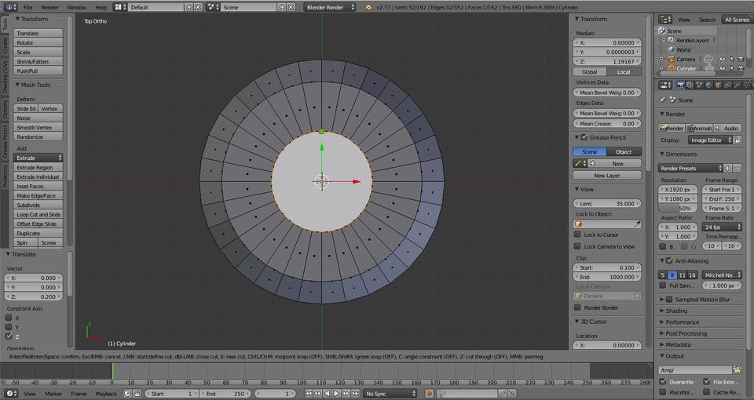

Switch back to top view with **NUM7\.** Press **K** to access the Knife tool.  

Slice the circle in half by hovering the cursor over the ‘top’ vertex. Click **LMB** to start the cut, then move the cursor to the ‘bottom’ vertex. Click **LMB** to place another point, then press **ENTER** to finalize the cut.

**NUM1** to front view, then press **NUM2** six times to rotate to the bottom of the mesh.

Select the bottom face.

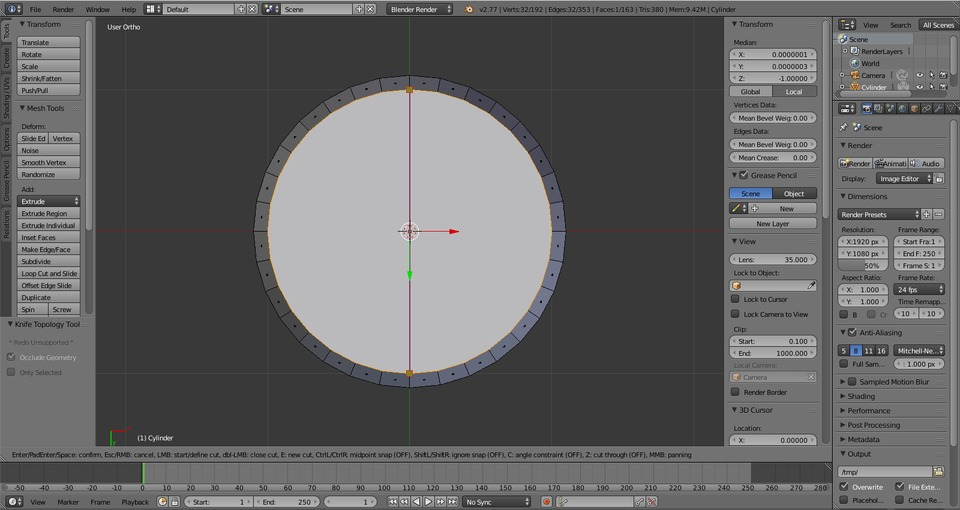

Using the Knife tool again, with **K**, slice the circle in half, pressing **ENTER** to finalize the cut.  

That’s the body. Now let’s add a head. Press **NUM1** to return to front view, then press **Z** for wireframe view.

Add a Cube with **SHIFT + A**.

Scale it down .8 with **S.** Press **ENTER** to confirm.  

Press **G** to Grace, **Z** to constrain the move to the Z-axis, and 2, to move it two Blender units. Press **ENTER** to confirm.

Scale the Cube on the Z-axis by pressing **S**, then **Z** and .6, followed by **ENTER.** Press **Z** to return to solid view. Then select the front face of Cube.

Press **E** to Extrude a new face and scale it down with **S** and enter .8, followed by **ENTER.**

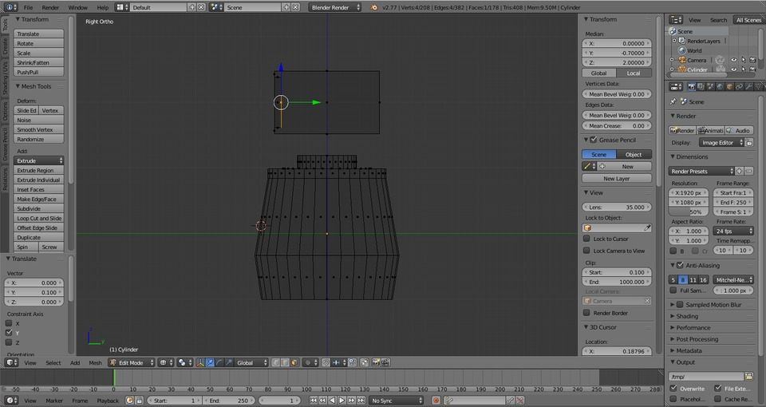

Press **NUM3** to switch to side view and press **E** again to Extrude a new face. Then **G** to Grab it, **Y** to constrain it to the Y-axis and enter .1 to move, followed by **ENTER** to confirm.

Add a Cylinder with **SHIFT + A**.

Press **R** to Rotate and **X** to do so on the X-axis and enter 90 to rotate it 90 degrees. Press **ENTER** to confirm.

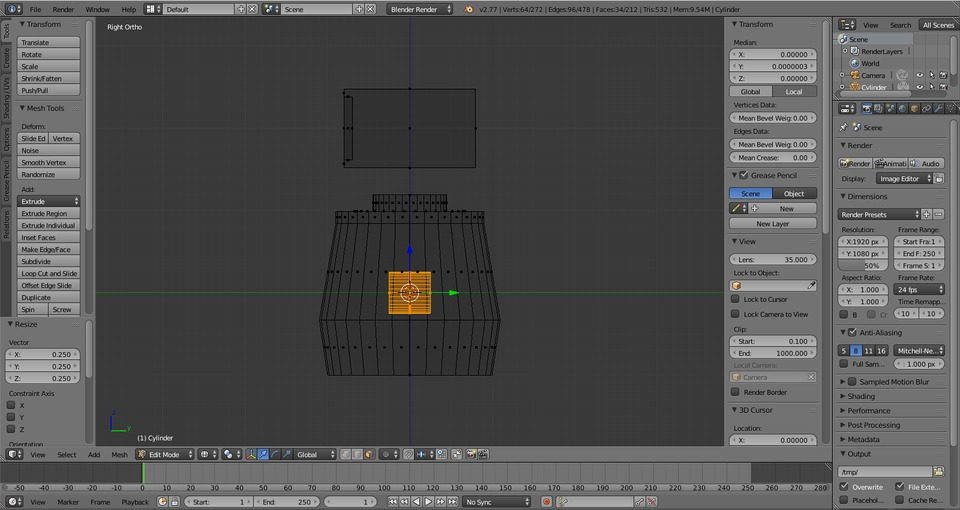

Press **S** to Scale and enter .25, then press **ENTER**.

Press **G** to Grab and, **Z** to constrain to the Z-axis and enter 2, then press **ENTER.**

Press **G** to Grab, **Y** to constrain to the Y-axis, enter -.7, then press **ENTER**.

Press **NUM1** to switch to front view, then **G**, **X**, .325 and press **ENTER**.

Press **Z** to switch back to solid view and select the front face of the Cylinder.

Zoom in if you need, using the scroll wheel. Then Press **E** to Extrude and **ENTER**. Scale the new face down with **S** and enter .75, press **ENTER** to confirm.

Press **Z** to switch back to wireframe view and **NUM3** to switch to side view.

Press **E** to extrude a new face, then **G** to Grab it, **Y** to move it on the Y-axis, and enter .02, then press **ENTER.**

Switch back to front view with **NUM1,** and back to solid view with **Z.** Create a loop cut vertically around the head with **CTRL + R**. Click **LMB** or press **ENTER** to confirm.

That’s the head. Now let’s connect it to the body. **Z** back to wireframe, then add a new Cylinder with **SHIFT + A**.

Scale the Cylinder down on the X & Y axes by pressing **S** and **SHIFT + Z** to exclude the Z-axis. Enter .15, then press **ENTER**.

Move the Cylinder up by grabbing it with **G**, pressing **Z** and enter 1\. Then press **ENTER**. Next create a series of loop cuts with **CTRL + R.** Be sure that you mouse is hovered over the neck and that the purple line is horizontal, then enter 32 and hit **ENTER** twice.

**Z** back to solid view. While holding **ALT + SHIFT**, select a vertical edge with the **RMB.**

Under the Select menu in the 3D View panel, select Checker Deselect.

While holding **ALT + SHIFT** select any horizontal edge with the **RMB.**

Under the Select menu again, select Edge Ring.

**CTRL + TAB** and select Face.

Extrude all the faces with **E** and press **ENTER**. Press **S** to scale the selected faces and press **SHIFT + Z** to do so only on the X and Y axes, then enter 1.1 followed by **ENTER.**

With the cursor hovering over the neck, press **L** to select the entire Cylinder.

And **SHIFT + H** to hide everything else.

Hold the scroll wheel down on your mouse, and move it about in the 3D View to change your perspective. Select the top and bottom faces of the neck (hold **SHIFT** to do so together).

And press **X** to Delete and choose Faces.

Press **NUM1** to return to front view and **ALT + H** to unhide the hidden faces.

Now for the arms. Select a face on the neck, and press **L** to select the entire neck again.

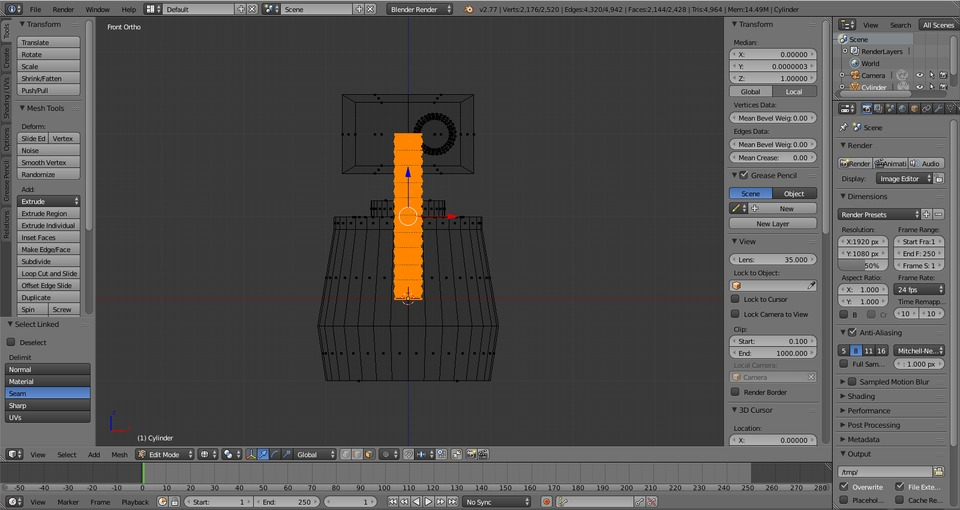

Toggle to wireframe view with **Z** and duplicate the neck with **SHIFT + D**. Press **ENTER** or **LMB** to confirm.

Rotate the new Cylinder on the Y-axis with **R**, **Y** and type in 90, then press **ENTER.**

Press **S** to Scale the new Cylinder and **SHIFT + X** to exclude the X-axis, then type in .75\. Press **ENTER** to confirm.

Grab the arm, **G,** and move it on the X-axis, **X,** 1.75\. Press **ENTER**.

Move the arm down with **G**, **Z**, and enter -.35\. Press **ENTER**. Press **SHIFT + S** to access the Cursor menu and choose **Cursor to selected.**

Add another Cylinder with **SHIFT + A.**

Rotate it 90 degress on the Y axis. **R**, **Y,** 90 and press **ENTER.**

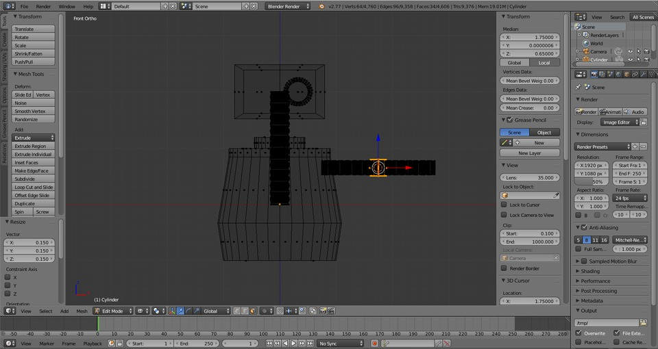

Then scale it down, **S**, .15, **ENTER.**

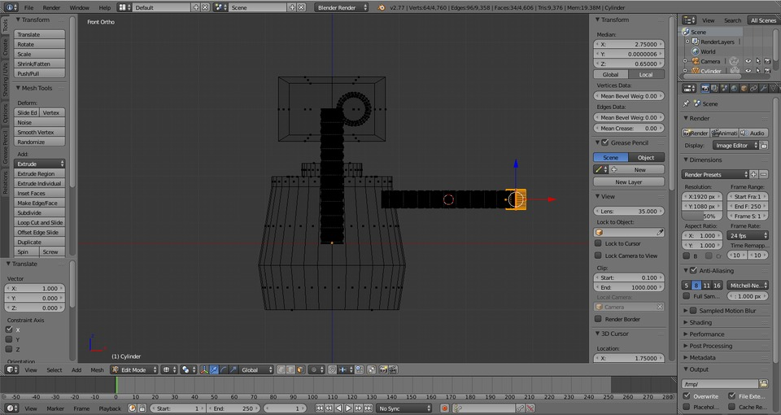

Move it to the end of the arm with **G, X, 1, ENTER.**

Press **A** to deselect the Cylinder.

Now we’re going to cut the mesh in half. Press **B** to access the Box tool. Click and hold the **LMB** to draw a box around the left half of the robot.

Press **X** and Delete Faces.

Our goal is to have a smooth edge down the middle of the mesh. You might need to clean up leftover faces. Use **B** for the Box tool to select them and **X** to delete.

**Tab** to Object mode. In the Properties panel, select the **Modifier** tab.

Click the Add Modifier button and select Mirror from the menu. The click Apply.

**Tab** to edit mode.

Press **SHIFT + S** and select Cursor to Center.

Now let’s add a mouth. **Z** to wireframe mode. Then add a Cube, **SHIFT + A**.

Press **S** to scale the Cube, and enter .6, followed by **ENTER.**

Press **S** to Scale again, this time on the Z-axis, by pressing **Z**, and enter .1, then press **ENTER.** Move the cube up with **G**, **Z**, 1.5 and press **ENTER.**

Press **NUM3** to switch to side view, then press **S**, **Y**, .5 and **ENTER** to scale the Cube .5 on the Y-axis.

Press **G** to Grab, **Y** to constrain the movement, and enter -.25 followed by **ENTER.**

Press **SHIFT + H** to hide everything else.

Press **Z** to switch to solid view and **NUM7** to switch to top view. Select the top face. Press **E** to extrude a new face, then **ENTER.** Scale the new face down with **S**, .9, and press **ENTER.**

And scale it again with **S**, **Y**, .9 and press **ENTER**.

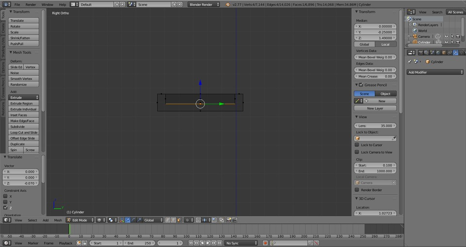

Switch to side view with **NUM3\.** And back to wireframe with **Z.** Extrude a new face with **E** and press **ENTER.** Grab the new face and move it down on the Z-axis -.07: **G**, **Z**, -.07.

Press **ALT + H** to reveal the hidden faces and press **A** to deselect everything. Press **NUM1** to switch to front view. Now, using **L**, select the head, eyes and mouth, but not the neck. Press **NUM3** to switch back to sideview. Move the head forward slightly by grabbing with **G**, constraining to **Y**, and entering -.25\. Then press **ENTER.**

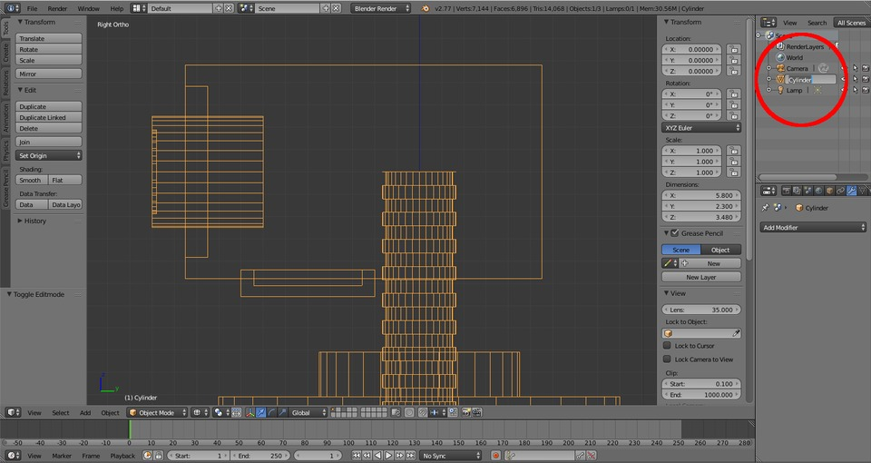

**Tab** to Object mode and rename the mesh from Cylinder to Robot. Press **Z.**

Hello World! Be sure to save your work, with **CTRL + S**. In [Part 2: Blender Materials and Shape Keys](https://dototot.com/how-to-model-and-animate-a-robot-blender-materials-shape-keys/), we will add color and simple motion to our robot. See you there!
