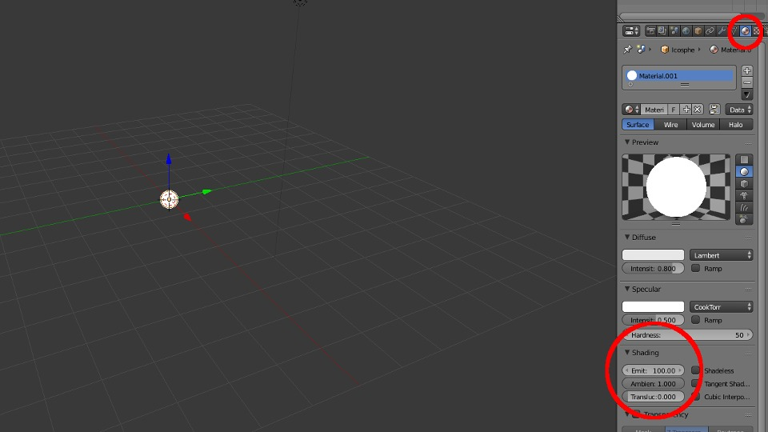
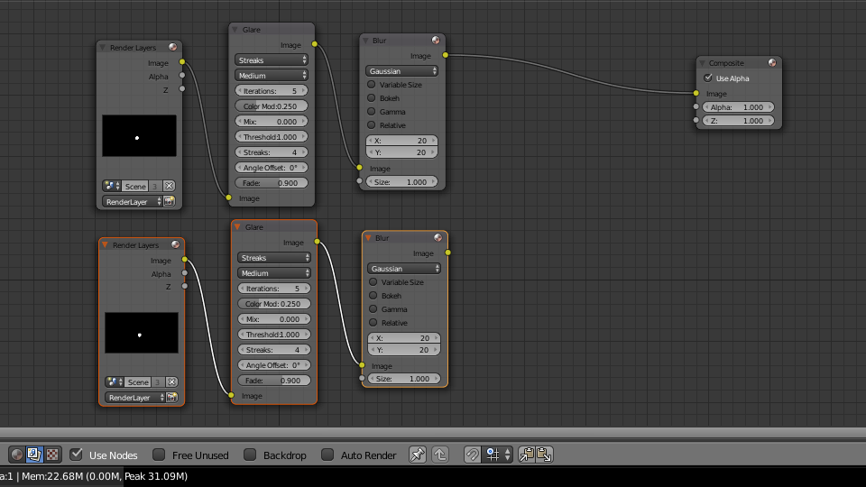
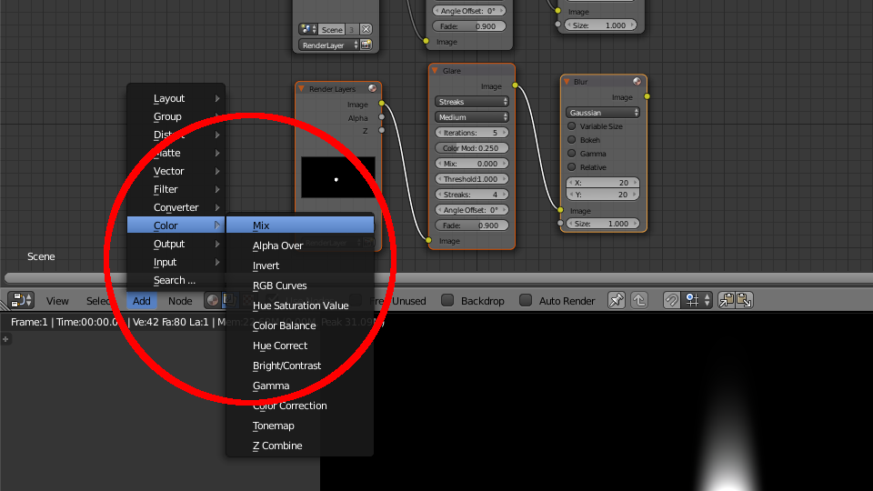
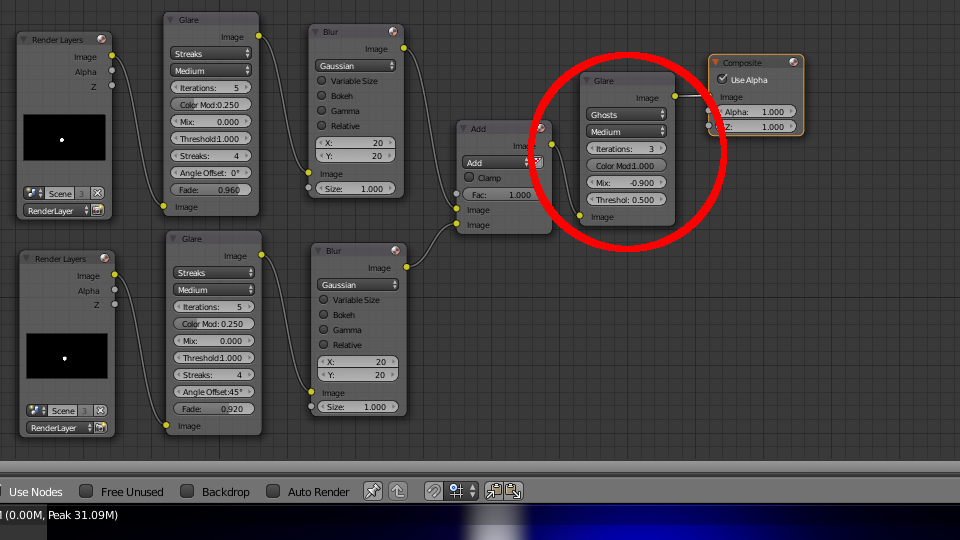

<iframe allow="accelerometer; autoplay; encrypted-media; gyroscope; picture-in-picture" allowfullscreen="" class="arve-iframe fitvidsignore" frameborder="0" name="" sandbox="allow-scripts allow-same-origin allow-presentation allow-popups" scrolling="no" src="https://www.youtube-nocookie.com/embed/-pYeoUcI1eA?iv_load_policy=3&amp;modestbranding=1&amp;rel=0&amp;autohide=1&amp;playsinline=1&amp;autoplay=0" width="480" height="270"></iframe>

This Blender tutorial demonstrates how to create a Superfriends-style starburst animation. We created this sequence for our series, [Superusers: The Legendary GNU/Linux Show](https://www.thehelloworldprogram.com/linux/ "Superusers: The Legendary GNU/Linux Show") which I strongly encourage you to watch if you are interested in Linux, free open-source software, and the surreal.

First, set the World Horizon color to black. It’s easier to see what we’re doing in the dark.

  
Then Delete the default cube and create an Icosphere and scale it down .25  
Next, add a Material and under Shading increase the Emit to something ridiculous like 100.

  
Now press F12 to render. This is our starting point.

  
We will be using nodes to create the starburst effect.  
So split the window and open the Node editor.

  
Select “Render layer”, then select “Use Nodes”.

  
Add a Glare Filter and increase the Iterations to 5.

  
Then add a Blur Filter and Increase X & Y to 20 or so.

  
Now, copy Render Layers, Glare, and Blur.

  
Add a Color Mix Node and set it to Add.

In the first Glare Filter, set the Fade to .96

  
In new Glare Filter, set the Fade to .925 and change the Angle offset to 45 degrees.

  
Next, copy one of the Glare Filters and set it to Ghosts.  
Change the Iterations to 3, the Color Modulation to 1.0, the Mix to -.9, and the Threshold to .5

Hit F12 again. There’s your starburst.

To animate it, set keyframes for the Angle offset.

  
Set the first Glare Filter to 90 and the second to 135.  
You will see your starburst rotate as we move through the timeline.

[Subscribe to our YouTube channel](https://www.youtube.com/channel/UCKtxWWqDiMPi2uUYfGL3YzQ "Dototot YouTube Channel") if you want to to keep up with future Dototot tutorials and videos. If you use this technique in a project, send us a link or post it in the comments below.
