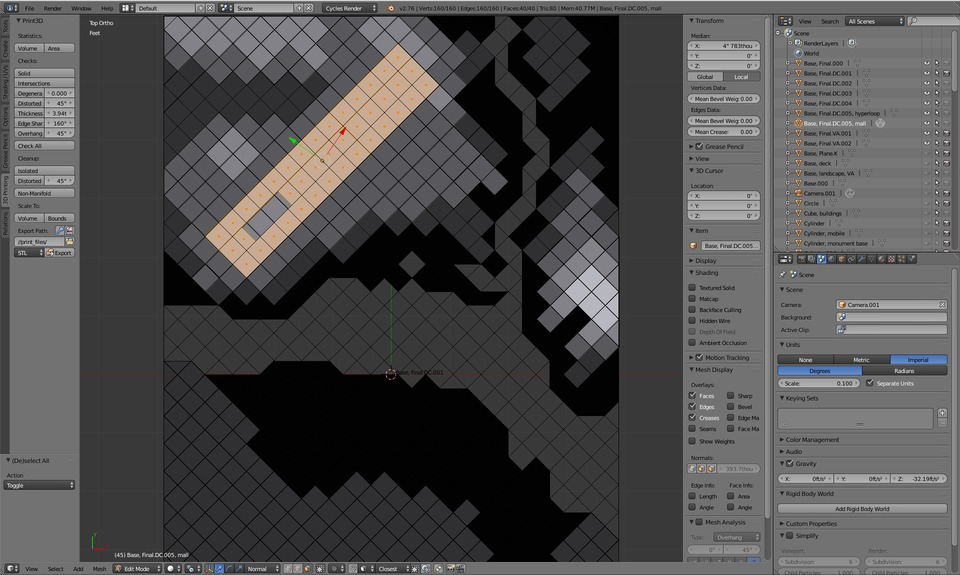
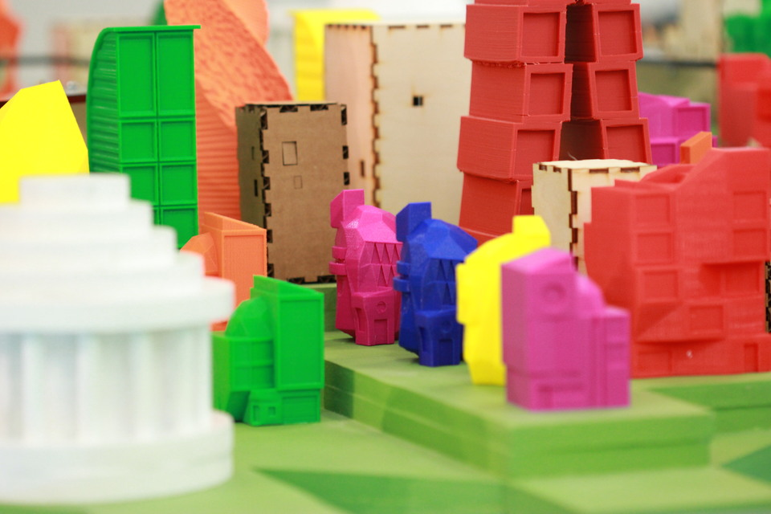
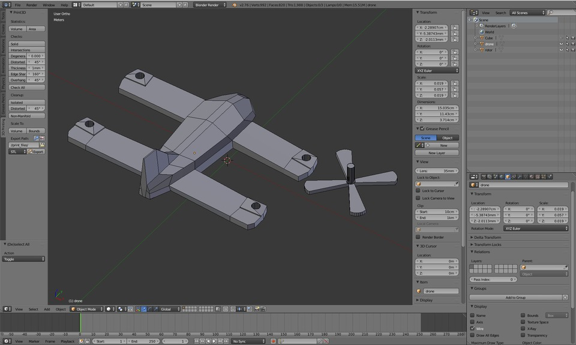
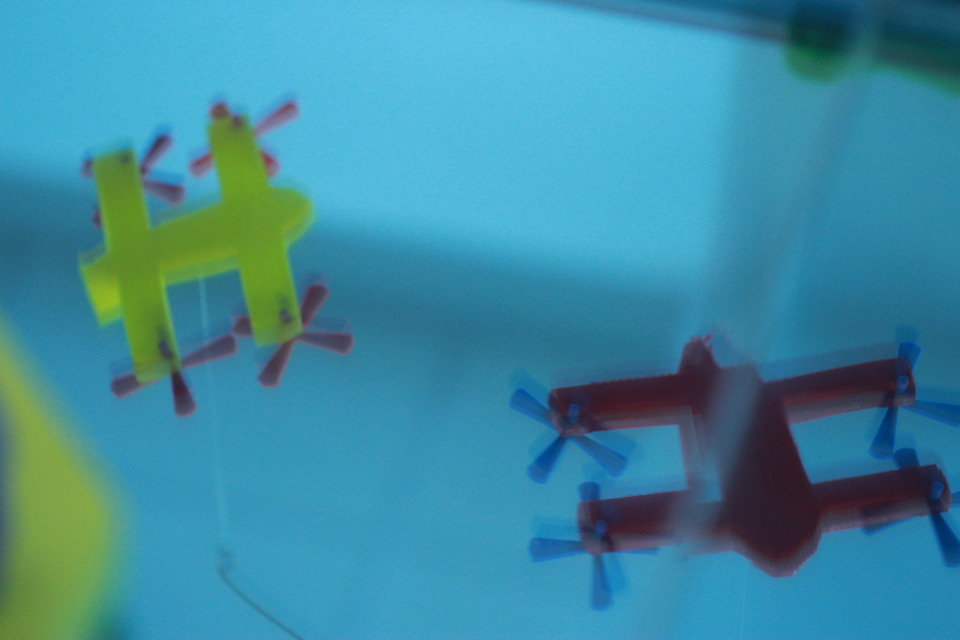
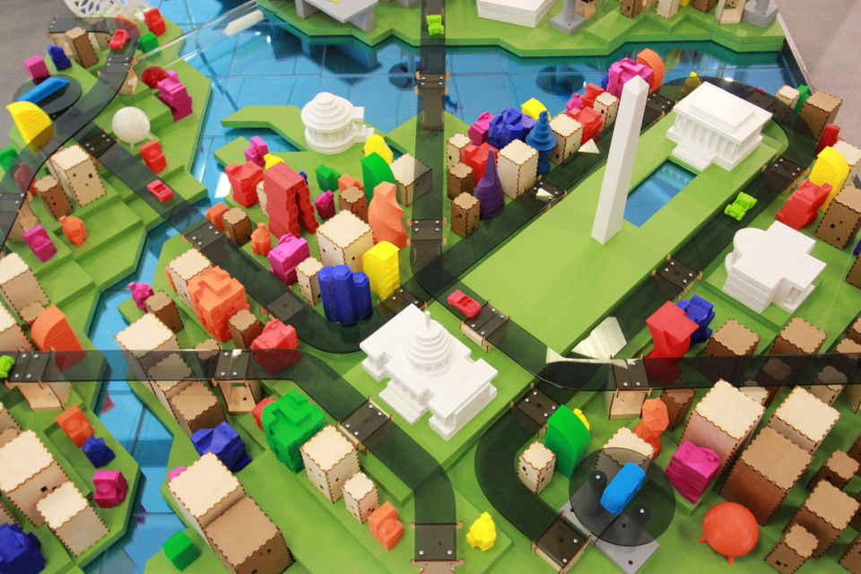

In a collaboration with [Two Bit Circus](https://twobitcircus.com/), we designed, fabricated and installed a scale model, artistic interpretation of the future of Washington, DC featuring 3D printed buildings and vehicles in the newly opened [LocalMotors storefront in National Harbor, MD](https://localmotors.com/posts/locations/national-harbor/). We used two of our favorite free, open source software tools to design and build this cityscape: Blender to plan the cityscape and model the 3D printed buildings and drones; and Inkscape to design the laser cut roads, platforms, stanchions, generic buildings and the [Capital Wheel](https://www.nationalharbor.com/the-capital-wheel/).

<iframe allow="accelerometer; autoplay; encrypted-media; gyroscope; picture-in-picture" allowfullscreen="" class="arve-iframe fitvidsignore" name="" scrolling="no" src="https://www.youtube.com/embed/QlnnuLQ8CVU" width="480" height="270" frameborder="0"></iframe>

We used a [Lulzbot TAZ 6](https://www.lulzbot.com/store/printers/lulzbot-taz-6) to print prototypes, but ultimately outsourced the full production to a local service via [3Dhubs](https://www.3dhubs.com/) in order to meet our deadline. With the exception of the cardboard buildings, which were made in Los Angeles, all of the laser cut components were fabricated at the [FabLab in the Martin Luther King, Jr. Public Library](https://dclibrary.org/labs/fablab) in Washington, DC. The roadways are ¼” cast acrylic sheets and the stanchions and plywood buildings are ⅛” birch, assembled with screws and glue, respectively. The generic buildings are [MakerCase](https://www.makercase.com/) files modified with “windows”.

The “water” constituting the Potomac and Anacostia rivers was constructed from four layers of 12×12” cast acrylic sheets, the bottom layer being mirrored and the upper layers a random combination of fluorescent blue and clear.

The terrain is hand-cut, stacked and glued sheets of MDF, as are the historical landmarks and monuments: Washington, Jefferson, Lincoln, US Capitol, Pentagon and White House.

