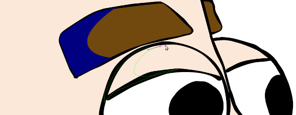

There are many ways to approach coloring in Inkscape. In this tutorial I’ll show you two methods that I like. Open up you graphic in Inkscape and lets get started. If you don’t have an inked drawing to work with, you might want to read the tutorial on [inking in Inkscape](https://dototot.com/inking-in-inkscape-with-the-calligraphy-and-tweak-tools/ "Inking in Inkscape with the Calligraphy and Tweak Tools") first.

Before we start coloring, I recommend grouping all of the lines together. You could do this the way we did before by selecting all of the lines (Ctrl + A) and grouping them (Ctrl + G), but you already know that trick, so lets learn a new one! This time, select all of your lines and choose “Path” then “Union” from the menu at the top. Looks just like grouping, doesn’t it? When we grouped our lines, Inkscape said, “oh! These lines are buddies now, so they should stick together inside of this nice little box I made for them.”

Then I said, “Inkscape please, do you have to say that every time I group something together?”

Unlike grouping, the union command will meld all of your lines together so that your outline becomes one object. This is great because it gives us better control over parts of the drawing that used to have overlapping lines. The downside is that union can’t be undone later. Grouping is nice because you can un-group at any time, but union makes fine tuning our lines easier.

But enough about lines, we’re here to talk about color. Lets make another layer underneath our outlines layer for our colors to live on. In the layers panel (Control + Shift + L to open) click the create new layer button with the outline layer selected. Name it colors and this time set the position to below current. Now click on the lock icon for the outlines layer so we don’t make any more changes to it, and if you’d like to you can delete you pencil sketch layer since we don’t need that any more.

The easiest way to color a drawing is with the paint bucket tool. That’s the one that looks like a tipped over can of paint. The parts you should color first are those that would appear behind any other colors. Think of your colors as a stack of paper cutouts and decide which one would be on the bottom. For my drawing that is probably the skin or shirt color. Right now it doesn’t matter what the color is set to, I just want something other than black so I can see the difference. With your outlines layer locked and the color layers selected, click on any of the colors along the bottom of the screen and try the paint bucket tool on part of your drawing.

That doesn’t look too bad from here! Lets zoom in to make sure everything is all right.

Notice how there are little gaps around the edges and a part of the skin on my forehead didn’t get colored? The paint bucket tool has a hard time wedging paint in little gaps unless we turn up the “Threshold” setting. That will help solve the forehead problem, but to solve the edges problem we’ll need to increase the Grow/shrink setting a little bit. A Threshold of 23 and a Grow/shrink of 0.6 worked quite well for my face.

Don’t worry about having a few gaps because you can use the node tool to adjust them later. Finish filling in all of the similar colored spots on your drawing. If you hold the shift key when you click a new area, it will union with the last shape. This will make adjusting the colors easier. If you find that the paint bucket is not doing anything, your shape is probably not closed off. If you are pretty sure the area you want to fill is closed off, try reducing the threshold and maybe bumping up the “Close gaps” option to medium. The zoom level can also affect how the paint bucket works, so try zooming out a little. On my drawing, the arm on the left and the shirt aren’t closed off at the bottom. I could just close them off and try the paint bucket tool, or I could show you another method for coloring.

Choose the pen tool on the left (Shift + F6), and look at the area in the top right that says “Fill” and “Stroke.” This shows a sample of the current fill and stroke settings, which likely changed to no fill with a black stroke when you selected the pen tool. We want to continue using the same color as the skin, so click anywhere on this area to open up the preferences window for the pen tool. Check “Last used style,” and close the window.

To color with the pen tool, zoom into the area you want to color and start tracing the outline. It doesn’t have to be perfect because the rough edges will be hidden behind the lines.

When you have finished with one color, you can union all of the parts. Hold shift while clicking with the select tool to select multiple shapes, then press Control + Plus or Control + Shift + Equals to union the parts.

I’m looking a little under the weather. Perhaps I should do something to liven up my skin. We can easily change the color from the fill and stroke panel. Look for the icon with a brush next to a white square on the left, or press Control + Shift + F to open the panel. On the fill tab of the fill and stroke panel there are a number of sliders that allow us to change the color. The R stands for red, G for green, B for blue, and A for alpha. Moving the slider to the right adds more of that color, and moving it to the left removes it. If all of the sliders are moved to the right, the color is white. If all of the sliders are moved to the left, the color is black. Play around with the R, G, and B sliders until you find something you like, but leave the A slider all the way to the right.

Using one or both of the techniques you just learned, continue coloring your drawing. I like the paint bucket method because it is fast, but find that it works best on simple shapes and often needs adjustments. The pen tool method will let you fill in very detailed areas, but it’s kind of tedious. Remember to work backwards with your coloring, filling in areas that would be considered behind other areas first. You can always move objects in front of or behind other objects with the select tool, but you’ll work faster if you plan ahead. When you’ve filled everything in, zoom in and scan around the edges of your drawing, making adjustments with the node tool where necessary. How does it look?

I’m liking where this is going, but it would look even better with some shadows. Make a new layer above the outlines layer called “Shadows.” I like to start my shadows with a color that is bright and obvious. This way I can clearly see which parts I have already shaded. So pick something from the swatches on the bottom and grab your trusty pen tool. Block out all of the areas that you want shaded. If you click and drag when you place a new node, you can adjust the curve, which will give you more natural shapes. As always, you don’t need to worry about being totally accurate because you can edit the shape later.

Unlike coloring, we don’t want to union our shadow shapes because they might not all be the same opacity. Continue merrily blocking out shadows with the pen tool until you are happy with the result.

Gross, it looks like there is slime all over me. Get it off! Get it off! Select everything on the shadows layer and open the fill and stroke panel. Drag the R, G, and B sliders to the left to make the color black. Now watch your drawing as you drag the alpha slider to the left. I set mine at about exactly 20 and already the drawing looks pretty good. With a little contrast, the shadows could look even better. Select the individual shapes and adjust the opacity to lighten or darken parts of the shadows. The shadows in my hair are getting lost, so I made them much darker, and the shadow on my neck is weird, so I made it much lighter.

The last thing we need to do–other than save of course–is make an ice cold lemonade. We’re all done!

Thanks for following along. I can’t wait to see your awesome drawings!
