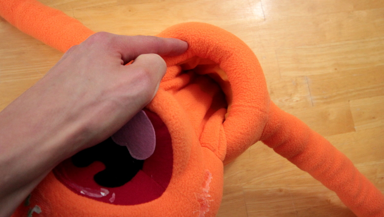
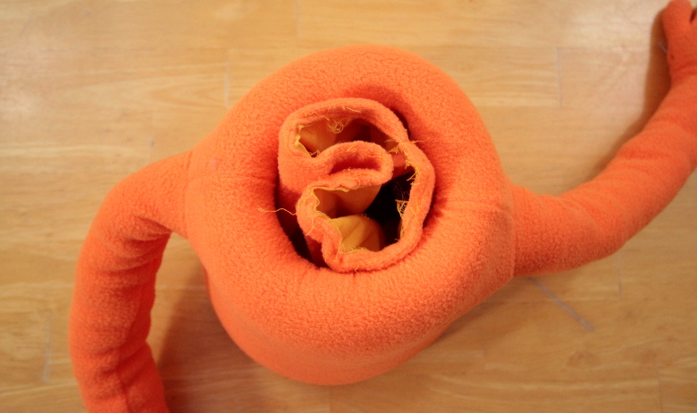
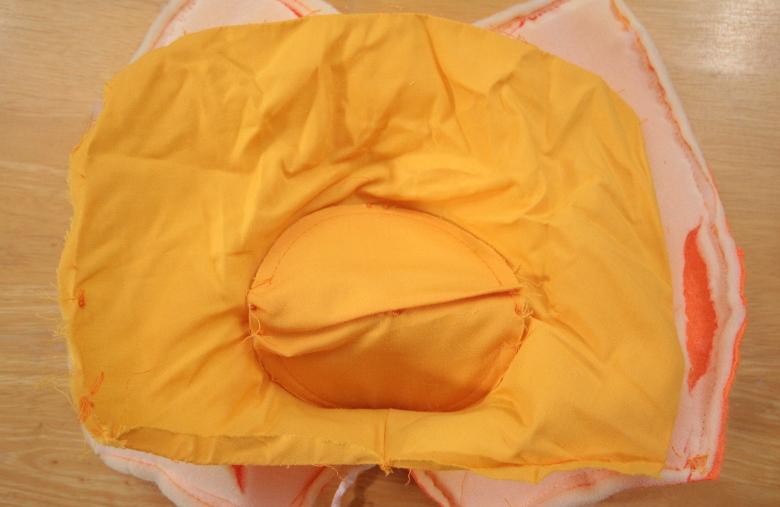
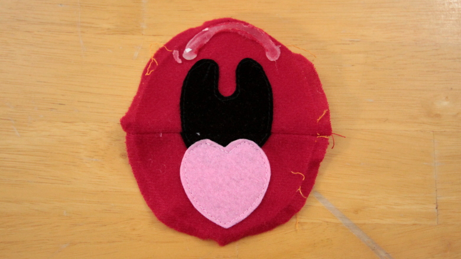
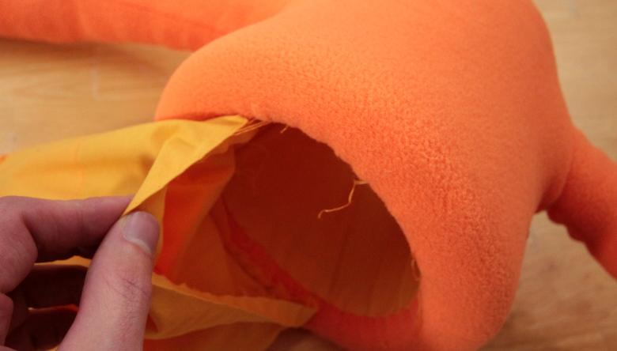
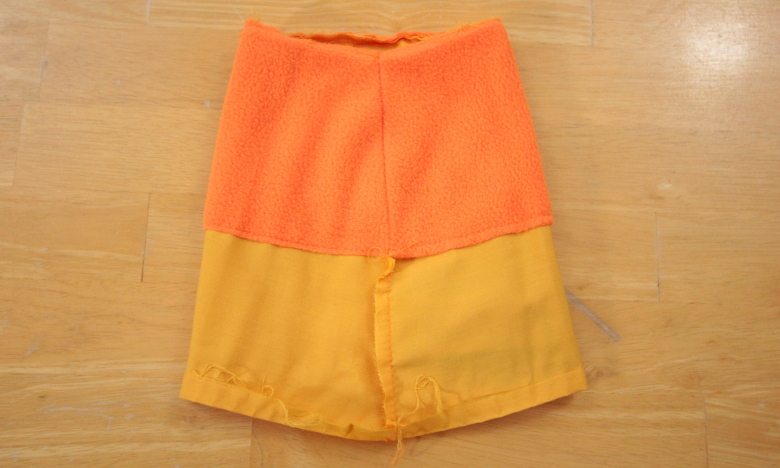
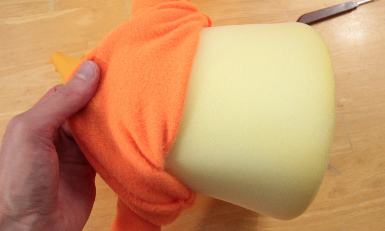

FAO Schwarz wants you to believe that their Whatnot puppets are real, genuine Muppets. After tearing mine to shreds, I’m almost certain these puppets have very little in common with the real deal. We received this particular creature as an award from Instructables for our [fox puppet pattern design](https://gumroad.com/l/fox-puppet). In the spirit of DIY, we set out to dissect our new friend and hopefully demonstrate how to reverse engineer a Muppet. I started by hastily ripping off the facial features, tearing a large hole in the face in the process.

That was when I realized how flimsy the fleece was, and so took it much easier on the puppet from then on, starting by carefully removing the wig.

Off with his head!

The head was loaded with poly-fill.

Inside of the head was a small pocket sewn to the mouth where one’s hand would go.

I removed the ears, finished picking apart the head seam, and did my best to patch up the hole I ripped earlier with a piece of tape.

Here’s a view from the back.

And again with the back of the hand pocket removed.

The mouth plate was only attached in four places, and so came out rather easily.

The mouth, face, and hand pocket were all sewn together.

Here is the extracted mouth piece, front and back.

Here is the face piece with most of the mouth and hand pocket removed. The little strip of yellow fabric you see there was holding the pocket to the face.

Here is the face piece from the front, all other parts removed.

These are all of the head pieces exploded for your viewing pleasure.

This is a view of every part from the hand pocket.

The arm tube came out easily enough.

This part is pretty self explanatory, so I didn’t pick it apart any further.

Removing the torso lining.

Removing the torso foam.

Here is the foam by itself…

…and the remains of the body.

These are the front and back torso pieces, with the arms and neck lining removed.

Taking apart the arm.

The arm piece laid out.

Peeking inside the puppet hand.

A closer look at the pose-able wire frame.

One final look at all of the hand pieces laid out.

And that’s all there is to a Muppet Whatnot! I hope you find these photos inspirational in designing your own puppets. To be honest, I don’t much care for this pattern, but it’s not a bad starting point. There are some good ideas throughout, particularly in the face piece. If I were to recreate this puppet, I would probably skip the whole hand pocket biz and bulk the head with foam instead of poly-fill. The solid plastic mouthpiece is also difficult to manipulate. A piece of foam glued to some stiffened felt would be much better. I also found it strange that the rod pocket in the hand was the same shape as the entire hand. All it needed to be was a square piece of fabric. But what do I know?
