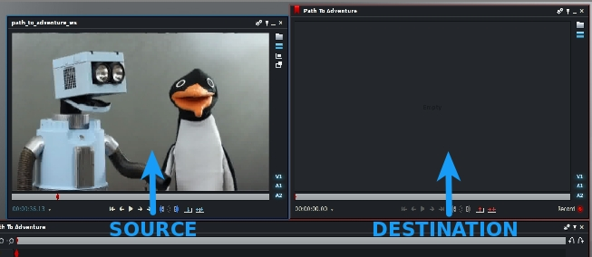
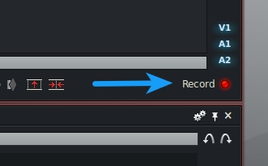
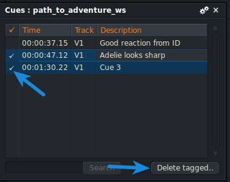

Now that you know [how to set up a project in Lightworks](/setting-up-your-first-lightworks-project/ "Setting Up Your First Lightworks Project"), I’m sure you are dying to edit something, so lets jump right into this. Throughout this tutorial, I’m going to be editing the “[Path to Adventure](https://www.thehelloworldprogram.com/linux/path-adventure/)” episode. Follow along by downloading the assets linked below (right click the link and choose save as).

[Path To Adventure Video Assets](./path_to_adventure_video.tar.gz).

Create a new 30 fps project and import the three video files. I’ve already converted them to a Lightworks preferred format, so despite what I’ve said before, you can import them with the “Copy Local” or “Create Link” option instead of transcoding them. Create a bin for your footage, a bin for you edits, and a rack for your bins. Then import the footage and drop it in your footage bin. You do remember [how to do all of that](/setting-up-your-first-lightworks-project/ "Setting Up Your First Lightworks Project"), right?

By default, Lightworks shows all of your bin contents as thumbnails. You may like this setup, but I find it a little cluttered. You can change this to a list view by clicking on the bin view icon at the top of your bin and selecting “list”.

Additionally, you can change the size of the thumbnails by clicking on the settings icon in the top right corner of your bin, and changing the “Thumb Size” drop-down to “Small”.

In order to share these assets with you online, I had to compress them significantly (sorry about the quality), and scale them down to 480p. The good news is this gives us an opportunity to learn something new about Lightworks! In the top left corner of the program is a tab with the name of your project. Click on this to open up the project settings. Then click on the “Video” tab, and select “NTSC 16:9” from the format dropdown.

[Video formats](/a-brief-primer-on-video-formats/ "A Brief Primer on Video Formats") are outside the scope of this tutorial, but suffice it to say that “NTSC 16:9” means the video is widescreen and measures 720 pixels wide and 480 pixels tall.

We’re all set up and ready to begin, so create a new edit and give it a name. Finally we get to the fun stuff! Sort of. Before editing, it’s always a good idea to review your footage. To do this, double click on any of the files to open a source monitor. You can tell the difference between a source monitor and the destination monitor by the colored outline. Blue highlighted windows are source monitors, and the red highlighted monitor is the destination.

There’s also a red light labeled “record” on the destination monitor. The label used here is a touch misleading. It doesn’t mean that the computer is watching you, or that you are recording the screen. It simply means that that particular monitor is where your source footage will be placed when you make an edit.

If you have multiple edits opened, this button is how you select which edit to write media to. If you click it now, the monitor outline will change to blue, turning it into a source monitor. This will make more sense when we start editing, but for now lets review our assets.

Single click on your source monitor to select it. The outline will increase in brightness when it is selected so you can easily tell which monitor is active. To begin playback, simply press the letter “l”. You can use the spacebar to start and stop playback, but I suggest that you get comfortable using j, k, and l to play back your videos. Trust me it’s cool. If you don’t believe me, try pressing the l key more than once. Whoa, it plays faster! Press k to stop playback. Now try pressing the j key to play it backwards. Just like the l key, you can press the j key multiple times to adjust the speed. You can also use l and j to increase and decrease the playback speed on the fly. Now here’s the really awesome part. If you hold down the k key and tap j or l, you can advance the playhead one frame at a time. How convenient is that?! You can quickly scan through a video with j and l, then use k in combination with j or l to fine tune your selection. It is possible to use the right and left arrow keys to move one frame at a time, but it will slow you down and it won’t feel as cool as doing it with j, k, and l. Of course you can also grab the playhead with your mouse and scrub through your video that way as well.

As you play through the videos, start to think about how you can edit it all together. If you find a clip that you think you will want to use in your final edit, you should place a cue point to make finding it later a snap. Simply press the apostrophe key to place a cue. It may seem like nothing happened, but if you look closely at the monitor’s timeline, you’ll see a small green triangle peaking out from behind the playhead.

That’s your cue point. It will stay attached to your clip even after you’ve closed your monitor. As you add more cue points, you might find it difficult to remember why you put them there. Luckily, you can add comments to a cue point from the Cue Panel. To open the Cue Panel, either right click on the monitor and select “Cue Panel” or press the apostrophe key again when the playhead is on top of an existing cue point. Go ahead and enter some descriptive text for your cue points in the Cue Panel.

The Cue Panel is also where you can delete cue points. Check the box on the left of any cue points you wish to remove, and then click the “Delete Tagged…” button at the bottom of the window.

Cue points are great for keeping your thoughts organized, but what makes them super awesome is how quickly you can jump to precise points in a clip. Try placing your playhead somewhere between two cue points and hit the “a” key. The playhead snaps right to the previous cue point. Now press the “s” key, and watch the playhead snap to the next cue point. Pretty radical, right? These keys can also be used to jump between in and out points. What are in and out points, you ask? Well… that’s a lesson for another time. Stay tuned for our tutorial on basic editing! In the meantime, familiarize yourself with the playback shortcuts while you review your footage.
