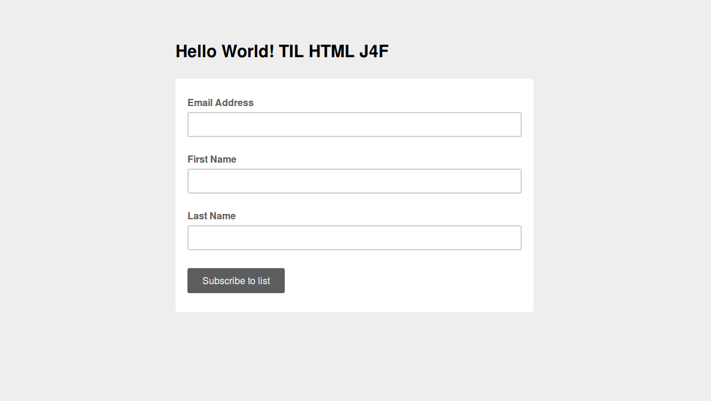

Over the next year we’ll be writing a series on email marketing and openly discussing our efforts and the lessons learned, using The Hello World Program as our, well, Hello World program.

## Email Marketing: If It’s Not Worth Writing, It’s Not Worthy of Your Readers

As this is the last year of The Hello World Program, we’re investing real energy in our mailing list. What does this mean?

- Consistency. We’ll be sending a newsletter every month.
- Adaptation. We’ll look at what worked and what didn’t and adapt our email marketing strategy accordingly.
- Quality. We’ll be actively producing new, engaging content every month.

At the time of this writing, the Hello World Program newsletter list has 310 subscribers. While this isn’t a big number, we have made absolutely no effort to encourage subscriptions other than a block on our website. We were inconsistent with our email marketing in the past, entirely because we are not always able to create enough new content to justify sending a newsletter. If it’s not worth writing, it’s not worthy of our readers. Here’s the report for our most recent newsletter (view the MailChimp archive here: [https://eepurl.com/bNUbEn](https://eepurl.com/bNUbEn)), sent out on January 23rd, 2016:

<table>

<tbody>

<tr>

<td>Campaign Report</td>

<td></td>

<td></td>

</tr>

<tr>

<td>Title:</td>

<td>The Hello World! Newsletter – January 2016</td>

<td></td>

</tr>

<tr>

<td>Subject Line:</td>

<td>[The Hello World! Newsletter – January 2016] This Year I Learned HTML J4F</td>

<td></td>

</tr>

<tr>

<td>Delivery Date/Time:</td>

<td>Sat, Jan 23, 2016 12:20 pm</td>

<td></td>

</tr>

<tr>

<td></td>

<td></td>

<td></td>

</tr>

<tr>

<td>Overall Stats</td>

<td></td>

<td></td>

</tr>

<tr>

<td>Total Recipients:</td>

<td>310</td>

<td></td>

</tr>

<tr>

<td>Successful Deliveries:</td>

<td>302</td>

<td></td>

</tr>

<tr>

<td>Bounces:</td>

<td>8 (2.6%)</td>

<td></td>

</tr>

<tr>

<td>Times Forwarded:</td>

<td>0</td>

<td></td>

</tr>

<tr>

<td>Forwarded Opens:</td>

<td>0</td>

<td></td>

</tr>

<tr>

<td>Recipients Who Opened:</td>

<td>109 (36.1%)</td>

<td></td>

</tr>

<tr>

<td>Total Opens:</td>

<td>162</td>

<td></td>

</tr>

<tr>

<td>Last Open Date:</td>

<td>2/2/16 4:21PM</td>

<td></td>

</tr>

<tr>

<td>Recipients Who Clicked:</td>

<td>36 (11.9%)</td>

<td></td>

</tr>

<tr>

<td>Total Clicks:</td>

<td>96</td>

<td></td>

</tr>

<tr>

<td>Last Click Date:</td>

<td>1/31/16 7:20PM</td>

<td></td>

</tr>

<tr>

<td>Total Unsubs:</td>

<td>0</td>

<td></td>

</tr>

<tr>

<td>Total Abuse Complaints:</td>

<td>0</td>

<td></td>

</tr>

<tr>

<td>Times Liked on Facebook:</td>

<td>0</td>

<td></td>

</tr>

<tr>

<td></td>

<td></td>

<td></td>

</tr>

<tr>

<td>Clicks by URL</td>

<td></td>

<td></td>

</tr>

<tr>

<td>URL</td>

<td>Total Clicks</td>

<td>Unique Clicks</td>

</tr>

<tr>

<td>https://eepurl.com/bNpmr9</td>

<td>63</td>

<td>29</td>

</tr>

<tr>

<td>https://youtu.be/TWKVI_WWHgY</td>

<td>15</td>

<td>10</td>

</tr>

<tr>

<td>https://youtu.be/qoIpGAzGoC4</td>

<td>11</td>

<td>11</td>

</tr>

<tr>

<td>https://youtu.be/k2nxmz8kEu0</td>

<td>7</td>

<td>6</td>

</tr>

<tr>

<td>https://www.youtube.com/user/helloworldprogram</td>

<td>0</td>

<td>0</td>

</tr>

<tr>

<td>https://www.thehelloworldprogram.com/</td>

<td>0</td>

<td>0</td>

</tr>

<tr>

<td>https://www.facebook.com/HelloWorldProgram</td>

<td>0</td>

<td>0</td>

</tr>

</tbody>

</table>

Our open rate was 36.1%, more than double the industry standard (according to MailChimp). And our click rate was 11.9%!  More than 6x the industry average of 1.9%. Those are great stats. The top number in ‘Clicks by URL’ is our primary CTA, Learn HTML. While we had 63 clicks, 29 of which were unique, we only had 2 new subscribers to our drip campaign. Why? I’m guessing because the sign-up page looked like this:

Not very inviting! We neglected to style the most important page in the sign-up process. Check it out now (and sign up for the course!): [https://eepurl.com/bNpmr9](https://eepurl.com/bNpmr9)

The next three links direct to Computer Science, Python and Linux videos. Because we put so much time and effort into them, I want to use the newsletter as a means to promote the videos that are languishing on YouTube. In retrospect, I shouldn’t have linked to YouTube directly, but to their respective pages on our site where the videos are embedded. It would drive both hits and views and if the video wasn’t to the guests liking, they might see something else they like (that we made). The clicks drop off significantly as we scroll down the newsletter. I’m not sure if that’s because users are engaged in the earlier links or if the subsequent links are old content.

I experimented with design in this newsletter. Because the Hello World Program consists of four thematic areas, Computer Science, Web Development, Python and Linux, I want to ensure that the email features one piece of content for each of these realms. Our previous newsletter iteration used a 1:2 column template. This wouldn’t work with four pieces of content, so I set up a 1 column template, which I like much better because the images are larger.

Many email marketing ‘experts’ suggest only one CTA with a button and using 1 column template. I think the 1 column template is much more attractive (especially with the buttons). But I disregarded the advice about limiting the newsletter to one CTA. We didn’t suffer from it. Our click rate is the same as previous newsletters, if not better. We also sent the newsletter on a Saturday, which the ‘experts’ say is a no-no. In the past we sent the newsletter on Wednesdays. The weekend didn’t hurt our stats; it might have helped in fact.

## Lessons Learned

- Link to your hosted content whenever possible. Don’t send subscribers to another platform that is designed to distract.
- The devil is in the details. Ensure design consistency across all pages and aspects of the sign-up process. If you leave things on default settings, your audience will choose their default, which is probably not what you want.
- Don’t believe everything you read.
  - The ‘experts’ insist on specific times and days of the week for maximum open and click rates. If your newsletter is good and people want to receive it, they’ll open and click.
  - The ‘experts’ also insist on extreme simplicity by using 1 column templates and only one CTA. While KISS is an acronym to live by, assume some intelligence on the part of your audience. They were smart enough to sign up for your newsletter in the first place. Give them some choice. But like shopping for toothpaste, don’t overwhelm them with options.
