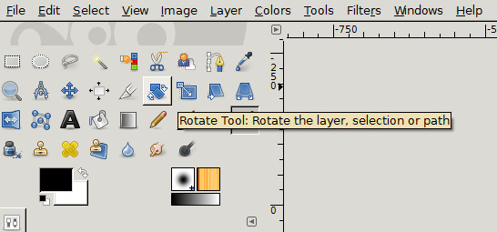
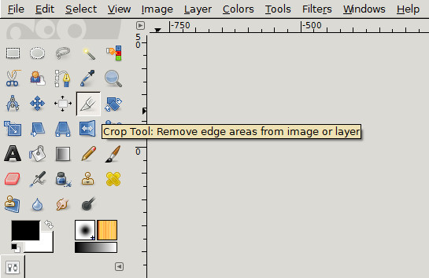
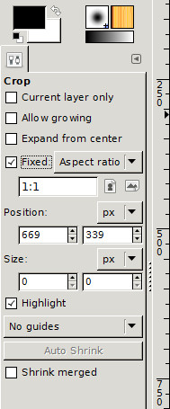
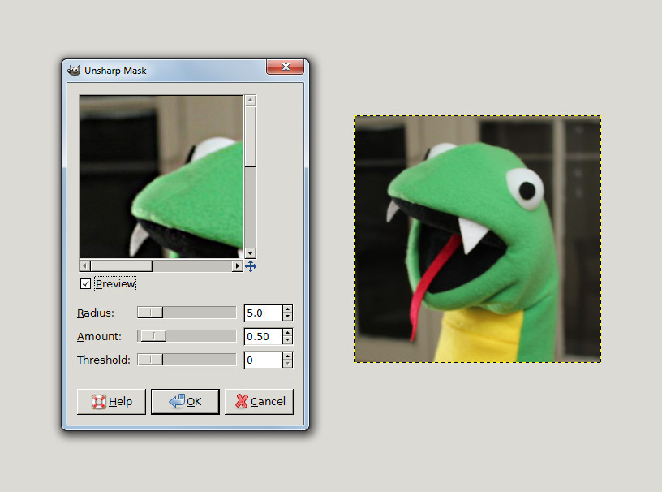

I’m sure you’re an accomplished photographer. But even Ansel Adams missed the mark on occasion. In this tutorial I will go over three very easy and useful tools in GIMP you can use to perk up your pics: **rotate**, **crop** and the **unsharp mask**.

First we need an image. I’m going to use this picture I took of Guido. At first glance, you might think there’s nothing wrong. That’s why this is the perfect photo for us to practice on. The changes we make will be very subtle but will enhance it considerably. There are three things I want to do to this photograph:

1.  You can see that Guido is listing to the right a bit; I’m going to rotate the image so the background is more or less perpendicular to the picture plane.
2.  I want to highlight Guido’s head and not the background or the table. We’re going to use crop to fix that.
3.  If you look closely, you’ll see that this photograph is out of focus. I’m going to apply an unsharp mask to correct it.

## Rotation

Select the rotation tool, either in the tool box, as pictured below, or by using using the keyboard shortcut **SHIFT+R**.

If you use the keyboard shortcut, the Rotate dialog will automatically pop-up. If you selected it from the toolbox, click on your image to open the Rotate dialog.

 In the Rotate dialog, you have the option of entering an angle value or of using a slider to adjust the rotation of your image. I used the slider and found a value of -2.77 to be just right. Upon hitting return, I got the following results:

 That’s much better. Guido now looks like an upstanding Python, not a slouchy snake. But what’s that weird checkerboard that appeared around the corners? That’s the transparent background layer. When we first opened our image, it was aligned with the GIMP canvas. But when we applied a rotation, we skewed the image out of alignment with the canvas. That’s easy to correct.

## Cropping

Select the Crop tool either by clicking its icon in the toolbox or using the keyboard shortcut **SHIFT+C**.

Before we use the Crop tool, take a look at the tool options dialog.

 I’m going to use my image as an avatar, so I want it to be a square. I could drag the crop tool around until I get what looks more or less like a square. Or, I can check the ‘Fixed’ box and ‘Aspect Ratio’ from the drop-down menu and enter 1:1\. That means the width and the height will be equal no matter how large or small I make my square. You will also see options to set the position of your crop and specify an exact size.

 To use the Crop tool, simply click and drag on your image. A square will appear. Notice that this square has smaller squares in the corners. Those are handles and you can use them to resize your cropping area. When you’re happy with the size of your square, hit Enter and your image will instantly crop.

## Unsharp Mask

Lastly, we’re going to fix the fuzziness of the focus using the Unsharp Mask filter. You’ll find it under **Filters: Enhance: Unsharp Mask**. It will bring up a dialog box like the one pictured below.

You have three options in this dialog: **Radius**, **Amount** and **Threshold**. The Radius slider lets you set how many pixels on either side of an edge the unsharp mask will affect. The Amount slider lets you set how strongly the unsharp mask will be applied. And the Threshold slider allows you to set the hardness of your edges. In a nutshell, if you set a high threshold, your edges will be softer, whereas a low threshold will make your edges harder. Play around with these settings.

I used the settings: **Radius: 5**, **Amount: 0.5**, **Threshold: 10**. These are minor and subtle changes, but you can see how Guido’s teeth, tongue and eyes are now more sharply defined.

For more information, see the GIMP Docs on [Rotate](https://docs.gimp.org/en/gimp-tool-rotate.html "GIMP Rotate"), [Crop](https://docs.gimp.org/en/gimp-tool-crop.html "GIMP Crop"), and the [Unsharp Mask](<a%20href= "Unsharp Mask")
