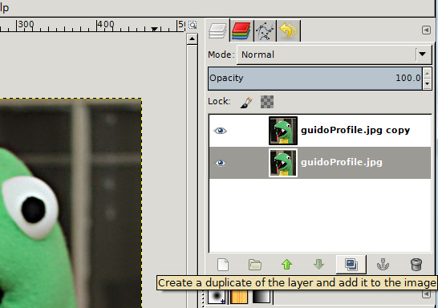
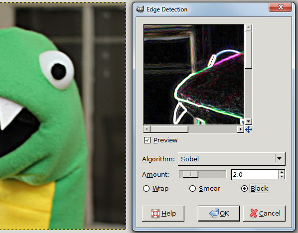
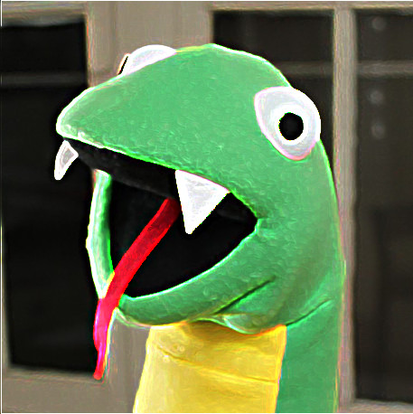

How do you make an awesome photograph awesomer? Cartoonify it!

In this tutorial we’re going to learn how to make a cartoon from a photograph using GIMP. If you want to follow along, you can download [this](./guidoProfile.jpg "this") picture of Guido. It’s the image we created in our tutorial [How To Fix A Digital Photograph in GIMP Using Rotation, Crop and the Unsharp Mask](/fixing-a-digital-photo-in-gimp-rotation-cropping-and-the-unsharp-mask/ "How To Fix A Digital Photograph in GIMP Using Rotation, Crop and the Unsharp Mask"). You should check it out if you haven’t already.

Let’s get started. Open your image in GIMP and follow these four quick and easy steps:

## Create a duplicate layer

You can create a duplicate layer in three ways. First, you can select **Layer>Duplicate Layer** from the menu toolbar. Second, you can use the keyboard shortcut **Shift+Ctrl+D**. Third, as pictured below, by clicking the Duplicate Layer icon in the Layers Dialog.

## Apply an edge detect filter

With your copy selected, from the menu toolbar select **Filters>Edge-Detect>Edge**. This will open a dialog box like you see pictured above. Select **Sobel**, set the amount to **1.0** and click the **Black** radio button. For stronger cartoonification, you may want to set your Sobel amount to 2.0.

## Invert the image

Now let’s turn our image inside-out! In the menu toolbar select **Color>Invert**. Cool, right?  

## Divide and conquer!

Lastly, in the Layers dialog, select Divide from the pull-down menu.

Voila!

