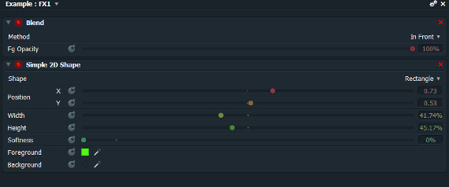

The 2D shape effect in Lightworks is used to superimpose simple shapes (rectangles and ellipses) on your footage.  It is found under the “Mattes” category in your effects selection.  This effect could be useful when making very simple titles, creating a spotlight effect, vignettes, and so on.  Unfortunately, to get the effect to do anything worthwhile is not so obvious.  If you apply the effect directly to your clip, it will completely overwrite the video with the new shape effect.  Notice in the video routing window that the original video has been replaced by the effect.

If you mark an area and apply the effect to the marked area, or if you add the effect to a clip as unfolded, it will put the effect on it’s own layer, but your video will still be obscured even if you adjust the alpha channel on the shape layer.  Checking the video routing, we see that there are indeed two independent clips; the 2D shape and the video footage.

This is closer to what we want since the video layer still exists, we just need a way to make the shape layer transparent.  That’s where the blend effect comes in.  Add the blend effect to your same selection by going to Effects -> Video, Mixes -> Blend.  There are two “blend” options.  We want the one with the description that says “Blend using one of seventeen different methods.”  At first it won’t appear to have made a difference, but look at the video routing and you can see that the 2D shape and the video layer are being combined with the blend effect.

Now when you play with the 2D shape controls it will behave more in line with what you would expect.  The first thing you’ll probably want to do is reduce the alpha channel on the background color to zero.  You can also choose different blending methods in the blend effect to achieve some interesting results.

Now go forth and make shapes!

