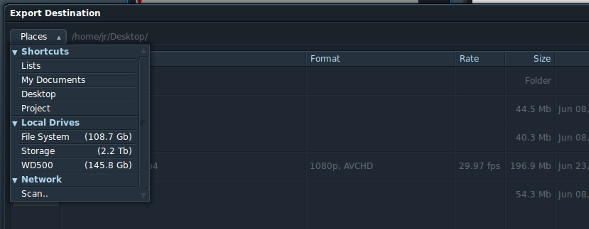

The Lightworks for Linux beta currently has many issues with exporting videos. Exporting to DVCPRO100 (the Lightworks preferred format) will result in a video that doesn’t play in some players or plays back with strange black borders in others. Exporting to UYVY will give you a ridiculously massive file in the range of ten gigabytes per minute. That’s because UYVY is totally raw, uncompressed video. Something about the way that Lightworks exports UYVY doesn’t play well with video converters, so you end up stuck with a huge archive video that Lightworks itself can’t even re-import! So until Edit Share fixes these problems, here’s a workaround for exporting a high quality master copy of your edits. Open the export settings window and change the format to “Image sequence” and the file type to “TGA”.


I found TGA produced the most consistent results. PNG sometimes introduced artifacts into random frames, and JPG looks to have been significantly compressed already. Click on the destination folder and navigate to where you want to save your exported video.



Create a new folder to hold your images. I’m simply calling mine “movie”.


Select the new folder as your destination folder and also set the name to something short and simple, like “movie”. This will be the prefix for the image files that Lightworks creates. Meaning all of the files will be named movie dash six digit sequence number dot tga.


Export the image sequence, then in the export settings change the format to “WAV”. Leave the destination folder and name the same, and export again.


We’ll be using a program called Avconv to compile our image sequence. If you don’t have it installed, you can do so with the following terminal command:

```bash
sudo apt-get install libav-tools libavcodec-extra-53
```

When that’s done installing, navigate to the folder you just made. Mine is on my desktop, so the terminal command would be:

```bash
cd ~/Desktop/movie
```

If you’re not familiar with navigating file systems with the command line, all you need to know is that “cd” stands for change directory, and the tilde before “/Desktop” is a shortcut for your home folder. Alternatively, depending on your Linux distribution, you could open the folder you made, right click anywhere in the folder, and select “open in terminal”.

Now for the real magic. Enter this Avconv command, replacing “movie” with whatever you chose for your file name prefix and changing the frame rate and video size to match your Lightworks project.

```bash
avconv -f image2 -r 30 -i movie-%06d.tga -i movie.wav -r:v 30 -c:v libx264 -preset veryslow -qp 0 -pix_fmt yuv420p -s:v hd1080 -c:a flac out.mkv
```

Lets break down this command so you know what’s happening here. The first thing Avconv wants to know is what files it should convert and anything special it should know about them. When converting a video, usually all you’d need to use is the “-i” flag to specify the input file. Since we have thousands of images we want to combine into one video, we need a few more options. Below is a brief description of all of the options used in this command.

**-f** specifies the format, in this case “image2” means an image sequence.

**-r** specifies the input framerate. This should match your Lightworks project.

**-i** specifies the input file. Because we have separate audio and images, we use the flag twice. Notice the first instance uses %06d in the file name to indicate that this part is an increasing number with leading zeros and 6 total digits.

**-r:v** specifies the output frame rate for the video. Set this to be the same as the input.

**-c:v** specifies the video codec. You can experiment with different codecs, but x264 will allow you to make a lossless video with a relatively small file size.

**-preset** is specific to the libx264 codec. It determines how fast your computer will process the video. Faster encode times will mean larger files, and slower encode times means smaller files.

**-qp** is specific to the libx264 codec and is what tells avconv to make this video lossless.

**-pix_fmt** is the colorspace for the video.

**-s:v** is the size of the video. You can use a shorthand string like hd1080, hd720 or write out a custom size as width by height, such as 1920×1080.

**-c:a** is the audio codec. Flac is a lossless audio codec with good compression, so it works well for our master copy.

When you’ve adjusted the options according to your video, run the command and wait patiently as Avconv crunches your video.


The only downside to the file we just made is that Lightworks won’t be able to import it. If you need to import this file into Lightworks, you’ll need to follow these instructions on [converting videos for importing into Lightworks](/convert-videos-for-import-into-lightworks-with-avconv/ "Convert Videos For Import Into Lightworks With Avconv").
