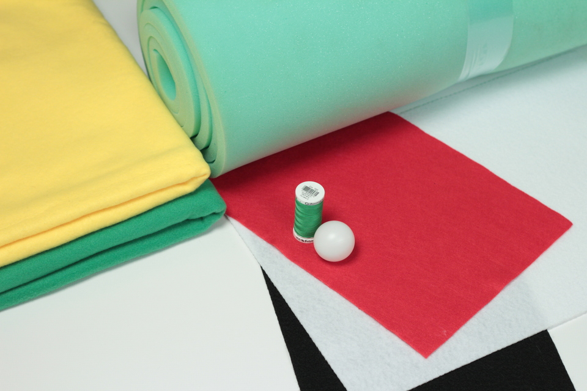
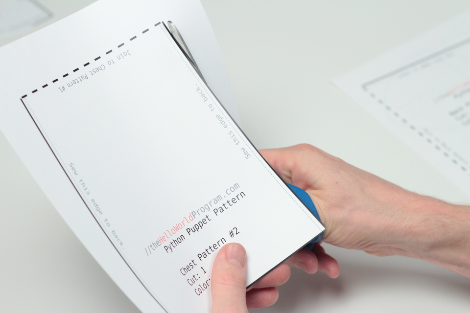
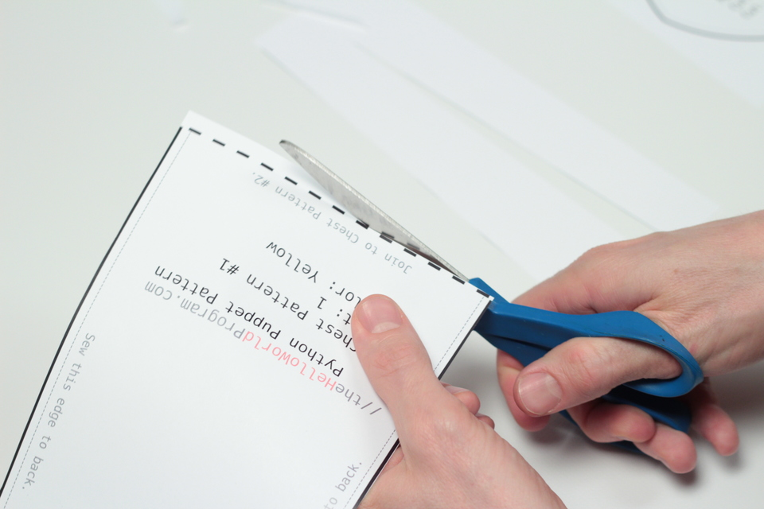
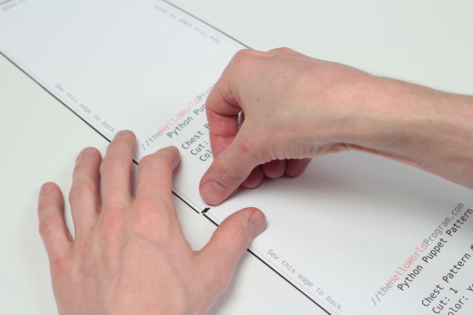
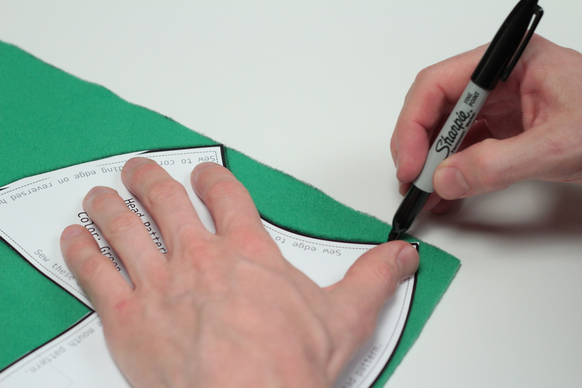
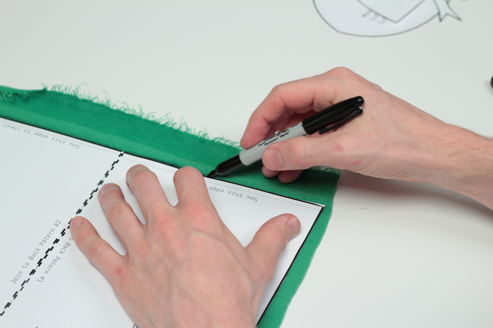
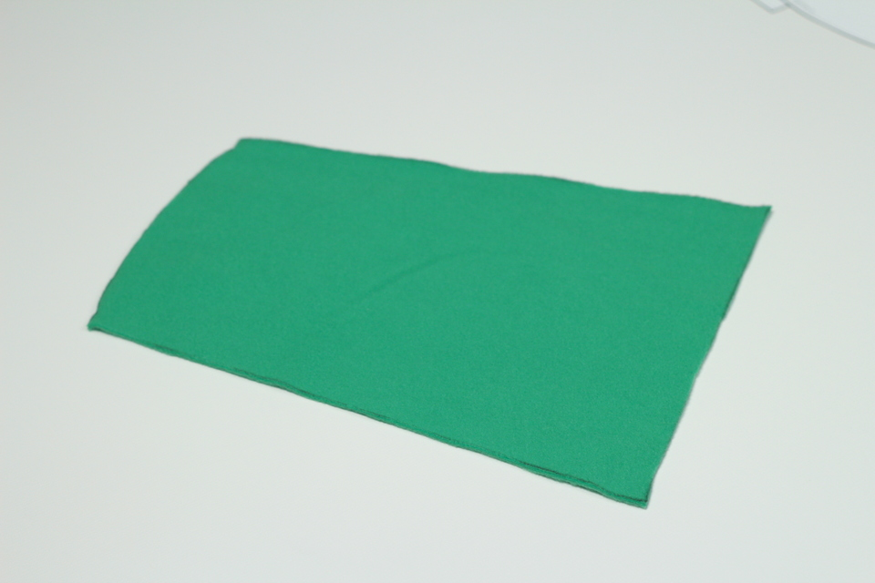
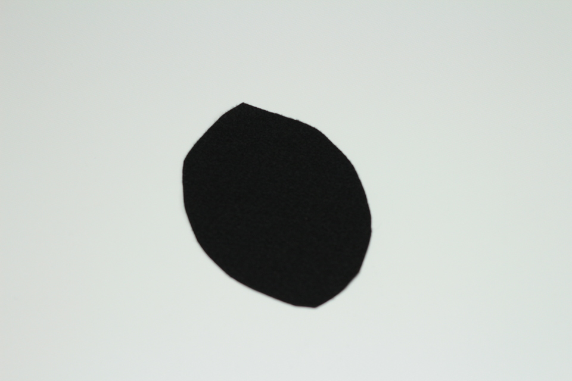
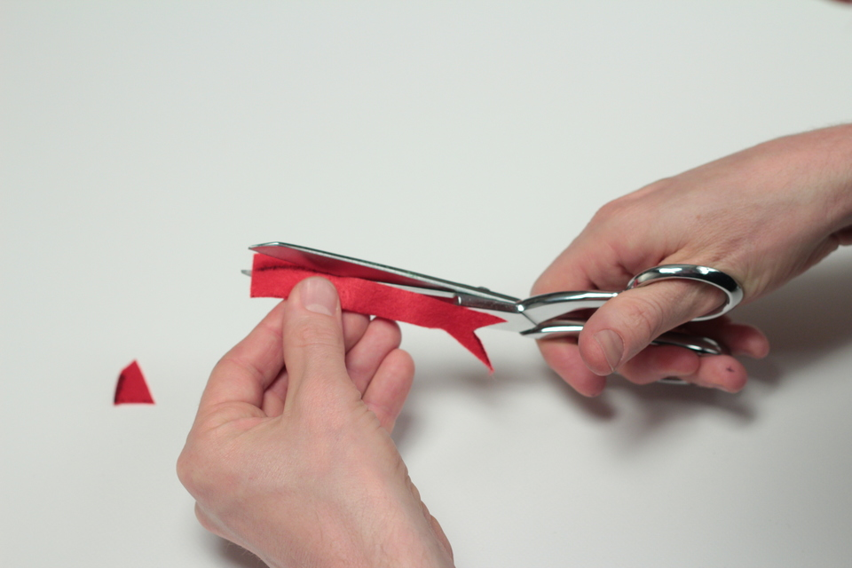
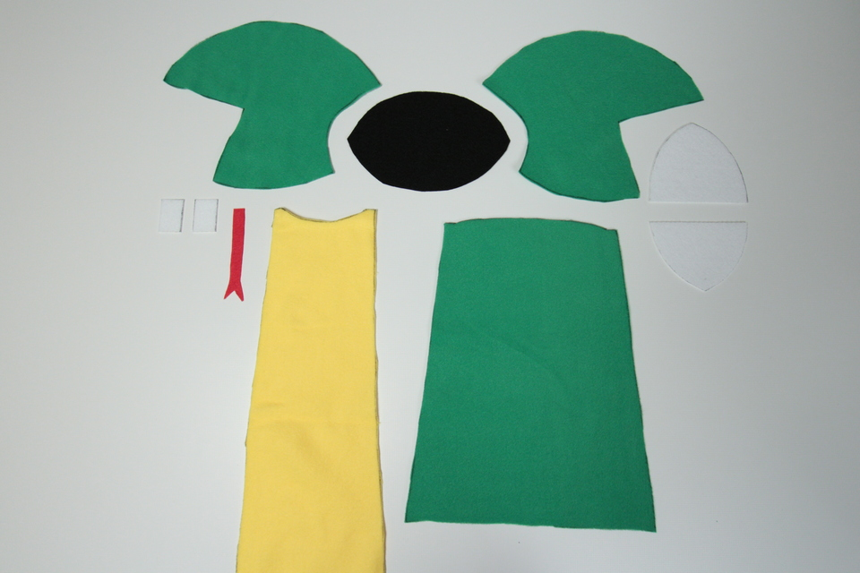

Making a professional, fleece and foam Muppet-style puppet is easier than you think. In this tutorial you will learn how to make a puppet with easily sourced materials. This is an excellent beginner puppet. Our design can be easily adapted and modified to suit your needs.

<iframe allow="accelerometer; autoplay; encrypted-media; gyroscope; picture-in-picture" allowfullscreen="" class="arve-iframe fitvidsignore" frameborder="0" name="" sandbox="allow-scripts allow-same-origin allow-presentation allow-popups" scrolling="no" src="https://www.youtube-nocookie.com/embed/bsXqCi4zp-s?iv_load_policy=3&amp;modestbranding=1&amp;rel=0&amp;autohide=1&amp;playsinline=1&amp;autoplay=0" width="480" height="270"></iframe>

We use this puppet in our series, The Hello World Program. His name is Guido and he teaches programming and poetry with [Python](https://www.thehelloworldprogram.com/python/).

## Materials & Tools

Materials you will need:

- green fleece, ½ yd. (if your fabric store will cut less than a yard, get ½; otherwise make more puppets with the excess!)
- yellow fleece, 1 ft.
- 1/2” foam sheeting, ½ yd.
- red felt, 1 sheet
- black felt, 1 sheet
- white stiffened felt, 1 sheet
- ping pong ball ([Ping Pong Balls White – 12ct Pack](https://www.amazon.com/gp/product/B005EGKNBQ/ref=as_li_tl?ie=UTF8&camp=1789&creative=9325&creativeASIN=B005EGKNBQ&linkCode=as2&tag=dototot-20&linkId=TUYVYGRCOUF7C636))
- green thread
- fabric glue or other very strong adhesive

Tools you will need:

- scissors (we recommend [Gingher 8-Inch Knife Edge Dressmaker’s Shears](https://www.amazon.com/gp/product/B000UU6SR4/ref=as_li_tl?ie=UTF8&camp=1789&creative=9325&creativeASIN=B000UU6SR4&linkCode=as2&tag=dototot-20&linkId=ORLUXOAWVEG4RVWL))
- sewing machine (or a needle and a lot of patience; we recommend a [Janome HD3000 Heavy Duty Mechanical Sewing Machine](https://www.amazon.com/gp/product/B00916Y4YM/ref=as_li_tl?ie=UTF8&camp=1789&creative=9325&creativeASIN=B00916Y4YM&linkCode=as2&tag=dototot-20&linkId=MOTKOCM6GDCTONND))
- sewing pins
- marker or tracing chalk
- tape
- python puppet pattern([available for purchase on our Gumroad page](https://gumroad.com/l/python-puppet))

## Cutting and Assembling The Pattern

The pattern is ready-to-print on a standard, household printer. This convenience requires you to assemble it somewhat as many of the puppet pieces are much larger than letter size paper. It will be obvious from the pattern and this tutorial which pieces to join and where. Begin by cutting the pattern out along the heavy black edges. You can tape the pieces together or simply set them on the fabric next to one another for tracing.

Here I am joining the two pieces of the chest pattern with a piece of tape.

And here I join the two pieces of the back pattern with tape.

## Tracing the Pattern; Cutting the Fleece and Felt

Let’s begin by tracing and cutting the head pattern. I recommend tracing on the “back” side of your fabric. Not all fleece is created equally. If one side is more textured and ‘fleecy’, this is the _right_ side, which is the side you want facing out after assembling your puppet. Trace on the flat, or *wrong* side. This will also hide all of your tracing lines inside the puppet after sewing. You don’t have to use a marker. Chalk or pencil work fine, too. But if you do use a marker, be sure to get a lot of ink on your fingers like I did.

Trace one side of the head pattern and then flip the the pattern over to trace the other side. Why? To ensure that the *right,* textured side of both pieces of your fleece is on the outside of the head when you assemble your puppet. If your fleece has an obvious grain, you will want it to be consistent across both pieces. In order to ensure consistency, mirror the head pattern, as below.

After tracing and cutting the head pieces, trace and cut the remainder of the pattern.

After tracing and cutting your fleece pieces, move on to the felt.

Trace and cut the mouth plates from the stiffened felt.

Then trace and cut two teeth from the stiffened felt. We will trim them into triangles after they are sewn into the mouth.

You can easily see how the pieces fit together. Part 2 of our tutorial will demonstrate how to [sew and assemble your Python puppet](/how-to-make-a-puppet-sewing-and-assembling-a-python/).
