This tutorial demonstrates the process for sewing and assembling a professional, Muppet-style puppet. If you don’t know how to sew, it’s not hard to learn. If you have access to a machine and a mature individual to teach you, politely insist on lessons. And if you don’t have access to a machine, you can still make this puppet by hand. It will take a little longer but you’ll grow so much during the process.

If you are just joining us, you will want to start with our previous tutorial, [‘How to Make a Puppet: Pattern and Materials for a Python’](/how-to-make-a-puppet-pattern-materials-for-a-python/).

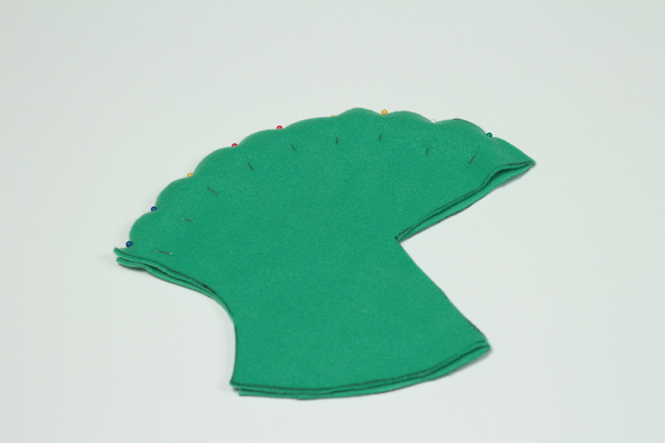

Let’s begin with the head. Align the two pieces of the head pattern in a stack so that the _right_ side of the fabric is sandwiched in the center and the _wrong side_ is facing out, top and bottom. Then pin one side. I barely know how to sew and find fleece to be very slippery, so I use a lot of pins.

Sew the pieces together, then pin and sew the other side of the head.

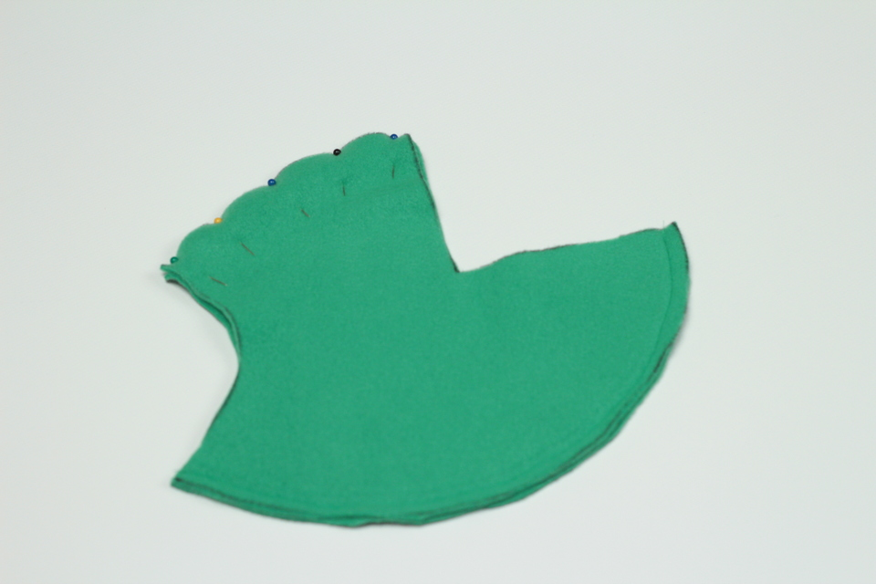

Next we will sew the mouth to the head. This is the hardest part of making this puppet (and it’s not that bad). The mouth piece is slightly larger than the mouth opening on the head. We designed it this way to allow you plenty of room to work with and to account for any inconsistencies in the stretch of fleece. Line up either the chin or the nose of the head with one of the ‘peaks’ of the mouth piece and pin it in place. Then work your way around the mouth, spreading the head towards the edges of the mouth, pinning as you go. It’s not important for the head to meet the edge of the mouth. Definitely don’t stretch the head to match the edges. Doing so will introduce a curve in the mouth that may look weird on your finished puppet.

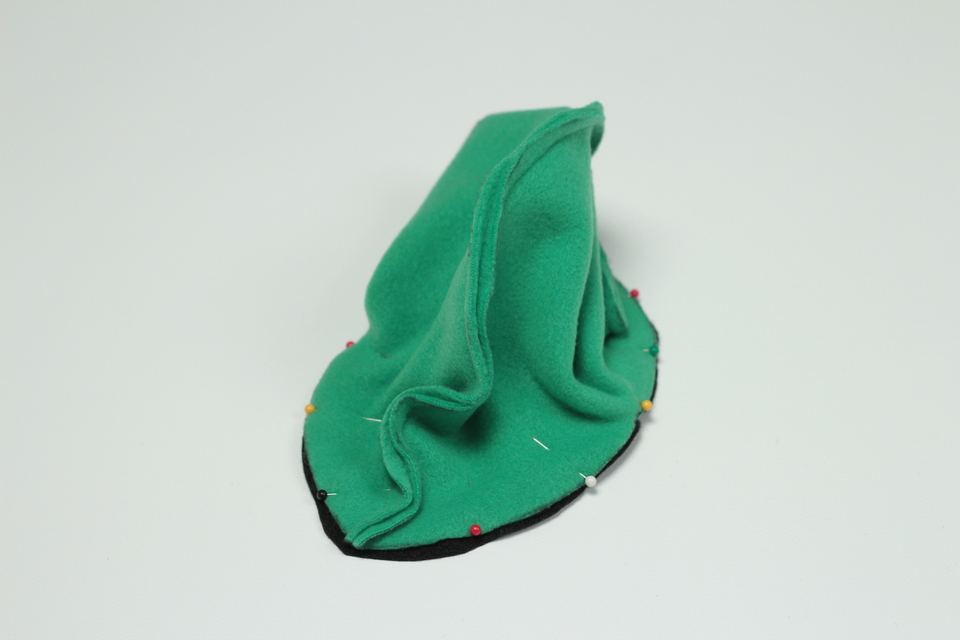

Before sewing the head and mouth together, insert the teeth. The placement of the teeth is up to you. I generally measure 2 to 2-1/2″ back from the peak of the nose. Be sure that you are inserting the teeth in the upper mouth, and not the lower, unless that’s the effect you want. Leave 1/4″ of an inch of the teeth sticking out. 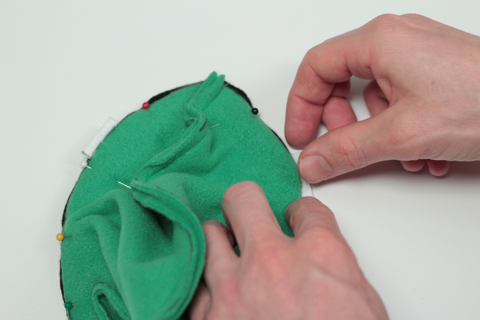

Then pin the teeth in place.

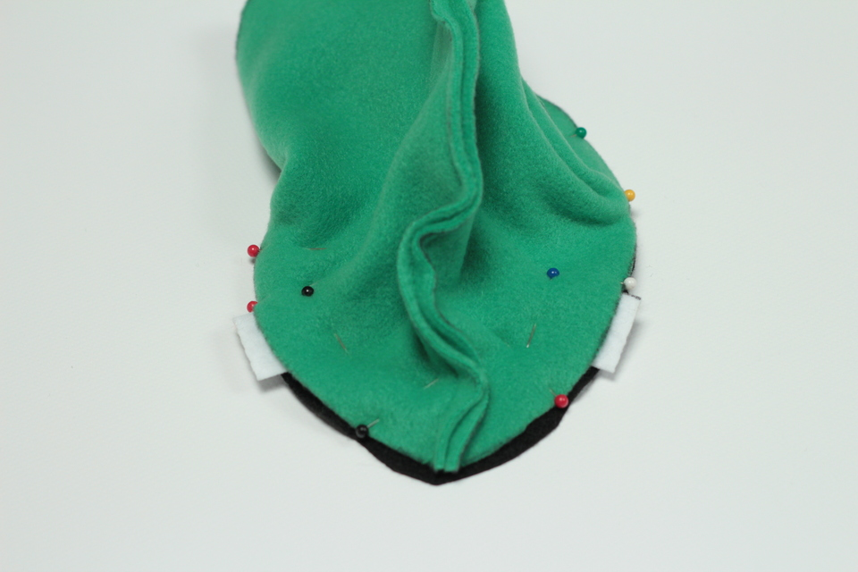

And sew the head, mouth, and teeth together.

Next, trace and cut the foam mouth plate.

Place the stiffened felt mouth plates on the foam mouth plate leaving a small gap between them in the middle and roughly comparable margin at the edges, as shown.

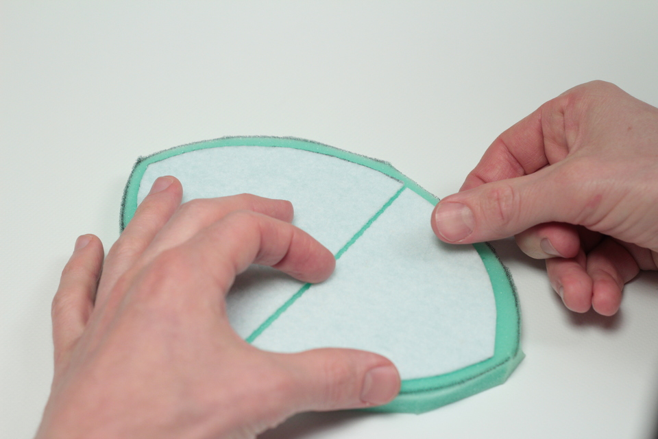

Then trace the mouth plates onto the foam plate.This will aid in applying glue and ensuring that both the mouth plates are correctly aligned. Note that one of the mouth plates is smaller than the other. The larger plate is the upper mouth and the smaller plate is the lower mouth. This will be important to remember when gluing the head to the mouth.

Using your glue or other strong adhesive, glue the stiffened felt mouth plates to the foam mouth plate. Allow it to dry then glue the head to the stiffened felt, being sure to align the mouth correctly with the stiffened felt plates. 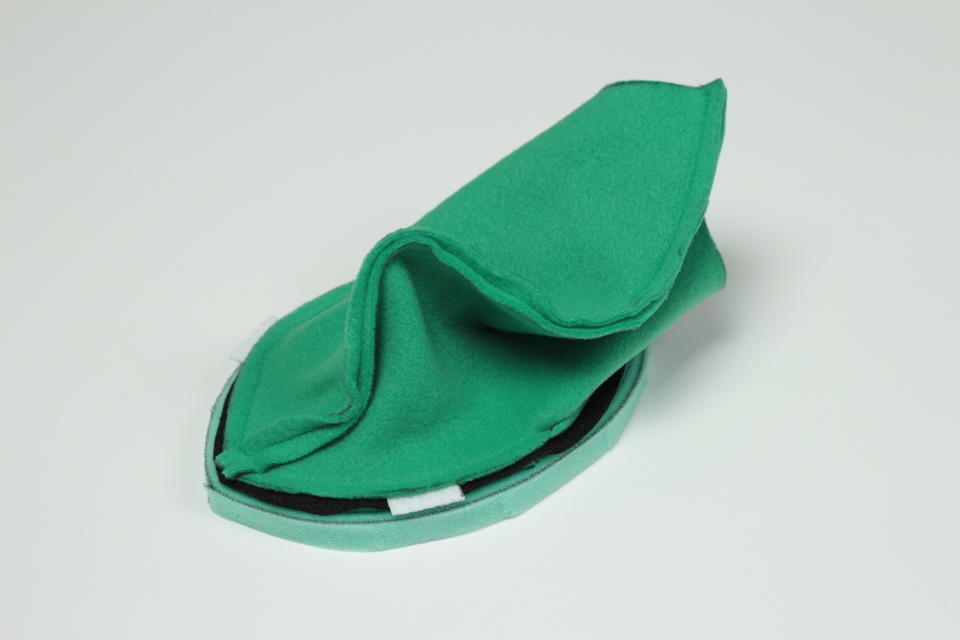

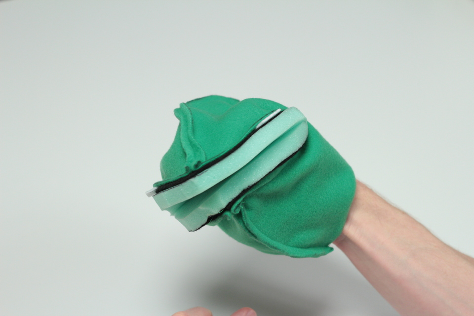

Allow the glue to dry, then turn your head inside out. The puppet head, that is. 

All of the complicated work is done. Now let’s sew the body, starting with the chest. This is where you’re going to need your measuring tape. Place the chest pattern _wrong_ side down and fold the top, or neck, over 1-1/2″, as pictured.

Pin, then sew, that fold.

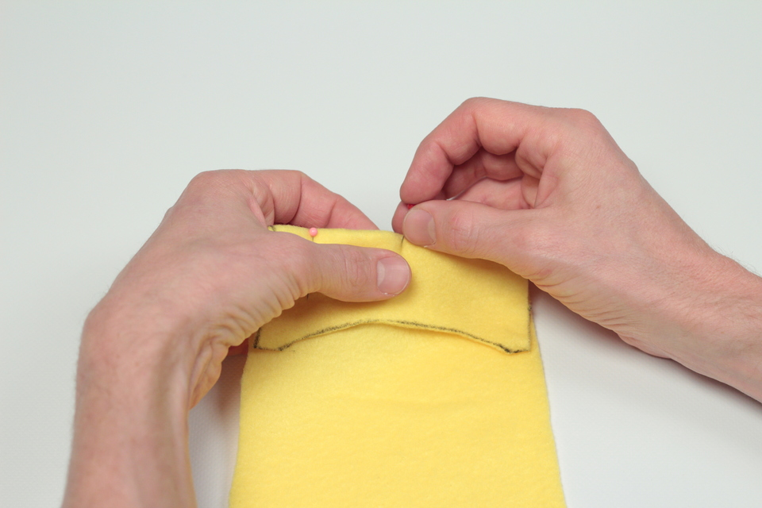

And repeat. Fold the neck over 1-1/2″, then pin and sew.

Continue folding, pinning and sewing until you reach the bottom of the chest piece. It should look something like this:

Now sew the chest pattern to the back pattern.

To attach the head, place the body chest side up and the head mouth side up, with the nose pointing into the neck.

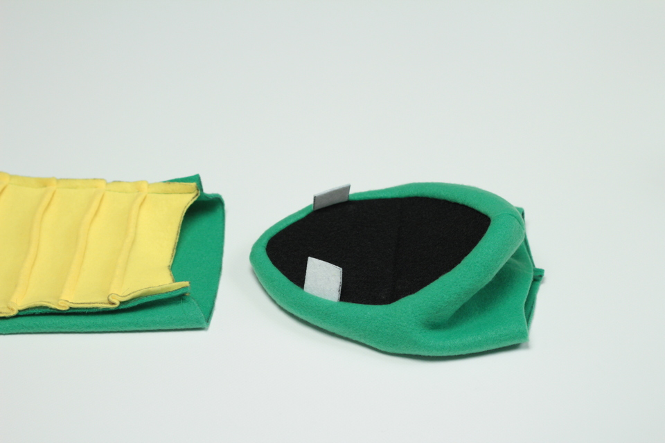

Then slide the head into the neck opening.

Line up the edges of the head with the edges of the neck opening and the center seam of the head with the center of the back and chest, respectively.

Then pin the head and body together.

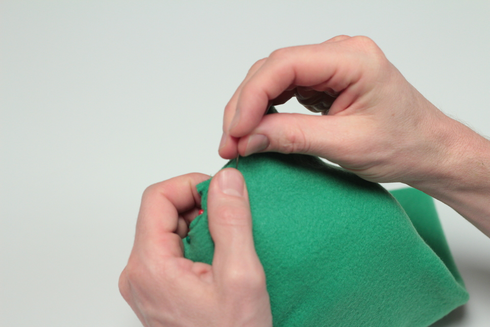

And sew!

Insert your hand into the puppets head and pull the body down over your arm, like a sock.

Time for dental work. Using very sharp scissors, cut the teeth into triangles.

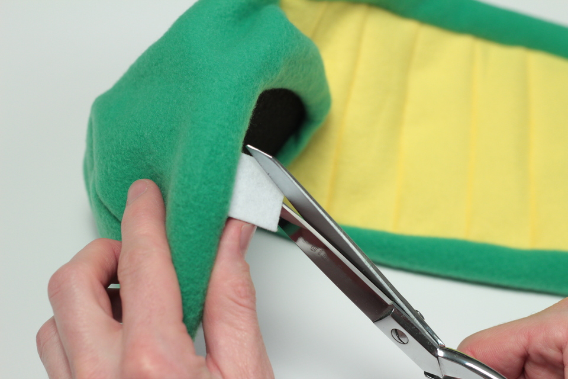

  

Using your very strong adhesive, attach the tongue to the mouth.

Very carefully cut your ping pong ball in two.

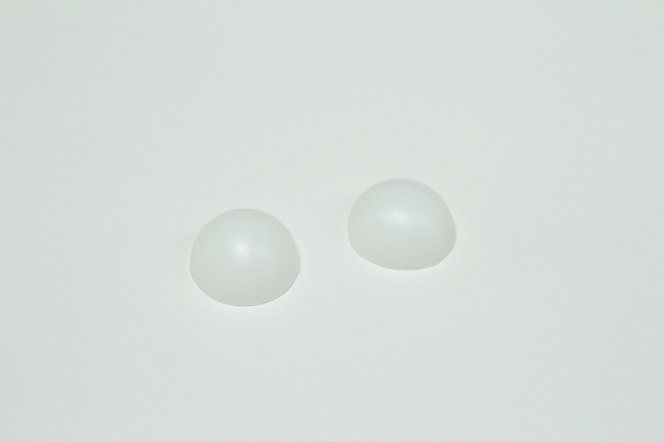

And using your very strong adhesive, glue the ping pong balls to the puppet head. When those dry, glue the pupils to the ping pong balls.

Congratulations! Now go create an educational web series.

<iframe allow="accelerometer; autoplay; encrypted-media; gyroscope; picture-in-picture" allowfullscreen="" class="arve-iframe fitvidsignore" frameborder="0" name="" sandbox="allow-scripts allow-same-origin allow-presentation allow-popups" scrolling="no" src="https://www.youtube-nocookie.com/embed/12jiiPFOwCE?iv_load_policy=3&amp;modestbranding=1&amp;rel=0&amp;autohide=1&amp;playsinline=1&amp;autoplay=0" width="480" height="270"></iframe>

