This tutorial will teach you how to craft your very own Muppet-style fox puppet. If you are just joining us, head over to part 1 of this tutorial: _[How to Make a Puppet: Pattern & Materials for a Fox](https://dototot.com/how-to-make-a-puppet-pattern-materials-for-a-fox/)_. We will be using a machine for most of the sewing, but you can do it all by hand if you really want to. Sew all of the seams with a 1/4 inch margin. We recommend reading through all of the instructions before you begin, so there are no surprises.

Ready when you are!

## Sew the face and chest

Start with your sewing machine threaded with white thread. We only need white thread for the face and chest pieces, so we’ll sew those first and get the white thread out of the way. Make sure you have your machine threaded with white thread for these steps or your fox will have orange lines running through her face. Your fox would not be very happy about that. Place the two face pieces right sides together and pin the chin in place.

Sew only the chin edge together (that’s the shorter curved edge).

Open the face piece, flip it so the right side of the face is lying on the right side of the chest piece, and line up the neck opening with the top of the chest.

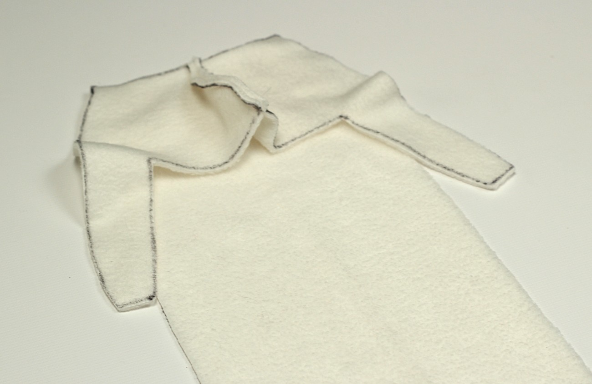

Pin it in place and stitch it together.

When it’s all done it should look something like this:

## Sew the arms

We’re all done with the white thread for now, so you can safely put it somewhere where you won’t be tempted to use it. Pin the black arm pattern #2 to the orange arm pattern #1 right sides together. Stitch the pieces together.

Fold the right sides of the arm piece together length-wise, making sure to line up the seams. Position one of the rod pocket squares where you would like the puppet rod to be inserted (this doesn’t need to be precise).

Mark the position of the rod pock on both sides of the arm (this does need to be precise).

Open the arm piece and stitch one rod pocket square to the wrong side of the arm piece on both sides, lining up with the markings we just made.

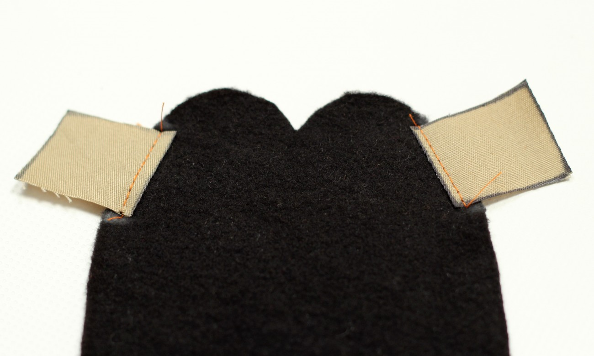

Fold the arm in half length-wise again, lining up the rod pockets and the arm #1/arm #2 seam and pin it in place.

Starting from the tip of the arm, sew around the black edge and stop with your needle lowered into the corner of the rod pockets. Pivot 90 degrees and continue stitching around the edge of the rod pocket.

Continue sewing the length of the arm piece, leaving the short orange end open.

Using a wooden dowel, turn the arm piece inside out and fill with polyester stuffing to desired firmness.

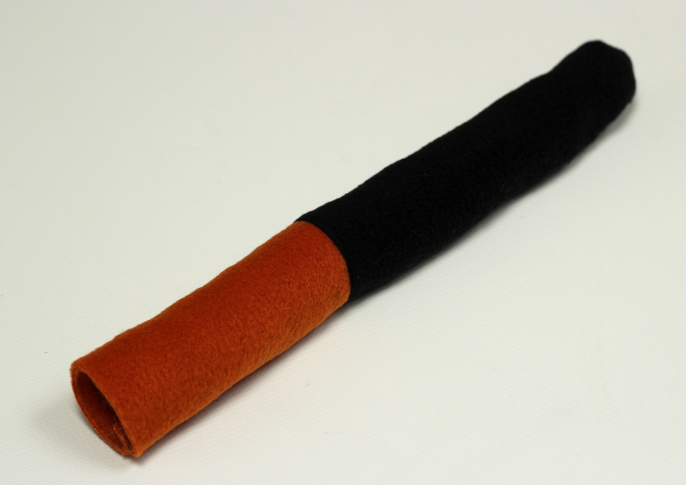

Flatten the opening of the arm piece, aligning the seam in the middle, then stitch it in place.

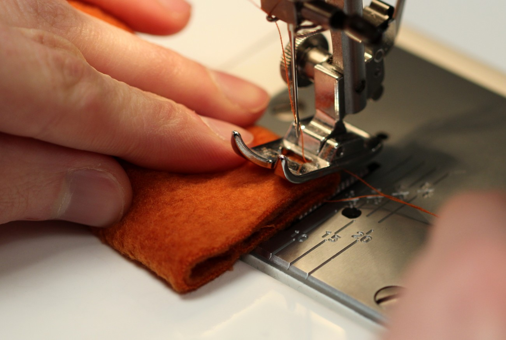

Now you’re a pro at making fox arms, so it’s no big deal to repeat these steps to make the second one.

## Sew the ears

Sewing the fox ears can be a little tricky if you want a fancy ear tuck, but I’m sure you can handle it! Start by pinning one white piece on top of one orange piece, right sides together.

Stitch all but the flat bottom part together and repeat for the second ear.

Trim some of the seam allowance from the tip of the ear, then flip it right side out.

This next bit is the tricky part. It’s not entirely necessary, so if it doesn’t make sense, just skip it. What we’re trying to do here is give the ear a little crease so it looks less like a triangular piece of fleece and more like a fox ear. To do this, roll one edge until the inside seam allowances lie flat against the orange fabric. Then fold some of the white fabric over itself so that the opposite seam allowances line up with their like color.

Stitch the ear tuck in place. If you don’t trust your machine sewing skills, now might be the time to hand stitch. The ear only needs to hold its shape until we sew it into the fox head, so it doesn’t need to be a perfect stitch. Repeat these steps for the second ear, but roll the ear tuck from the opposite side so that the finished ears appear to be mirrored.

## Attach the arms

Attaching the arms and ears to the body can be difficult to pull off with a sewing machine because you’ll be stitching through four layers of fleece. It can be done, but we officially recommend hand stitching these seams. We’ll begin by sewing the arms in place. Using the body pattern as a guide, mark and cut slits for the arms in the orange body piece.

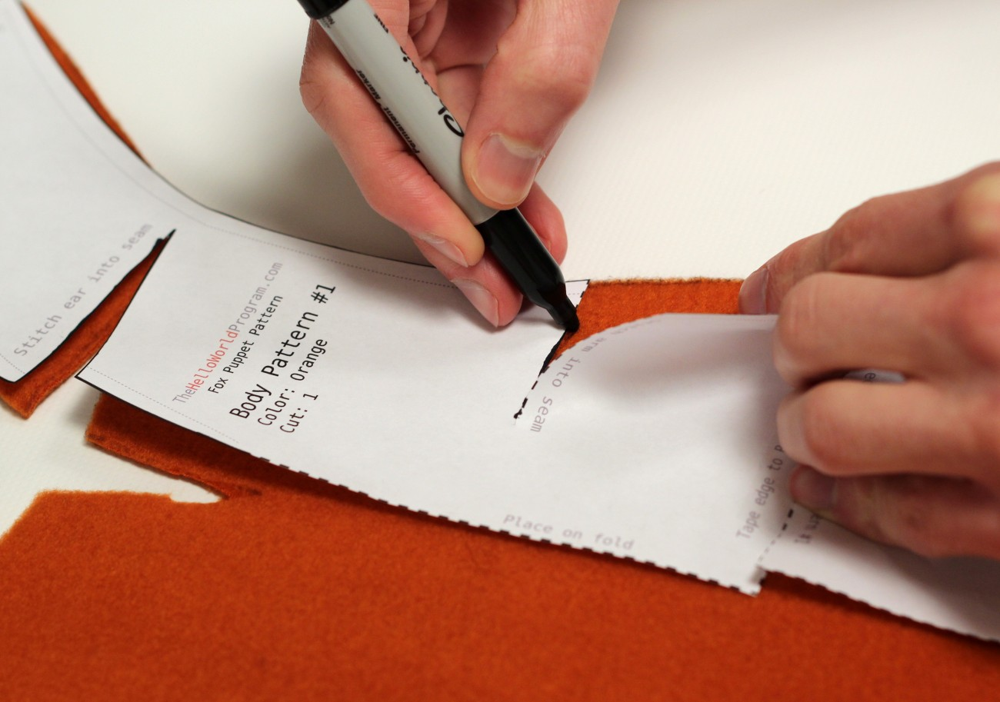

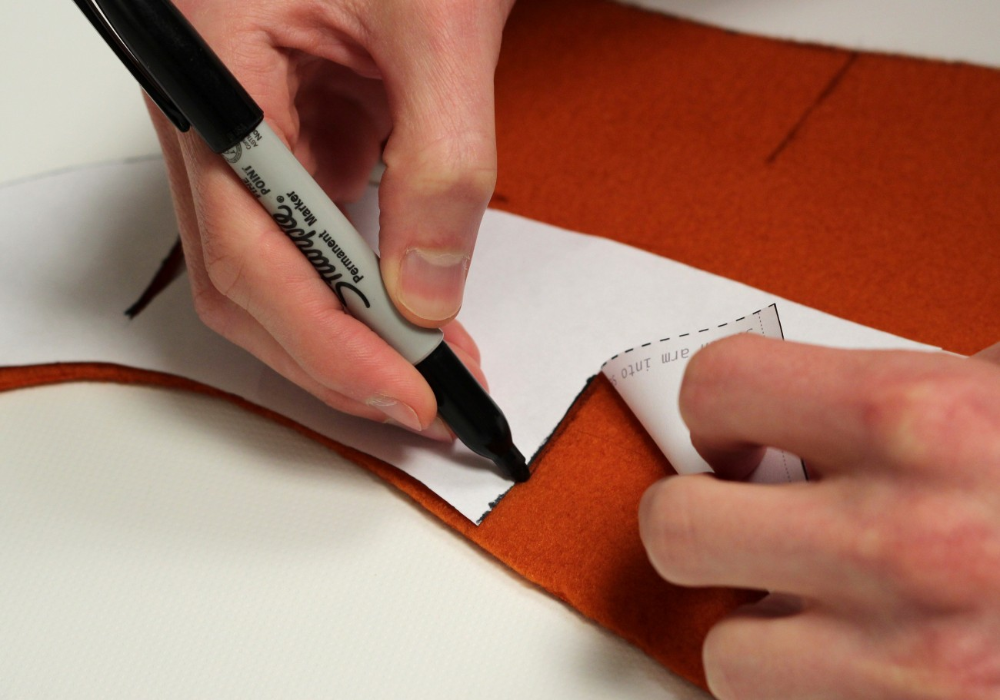

Line the top edge of the finished arm up with the bottom edge of the arm hole in the body pattern. Make sure the right sides of the fabric are together and that the arm seam points toward the center of the body piece.

Flip the top half of the body over the arm, align the edge of the arm hole with the top of the arm, and pin it in place.

The top of the arm should be flush with the two edges of the arm hole. There should also be a 1/4 inch margin on the outside edge of the body, before the arm. If there is not, cut the arm hole a little bit deeper. If all is well, stitch the arm in place.

Repeat this technique for the other arm.

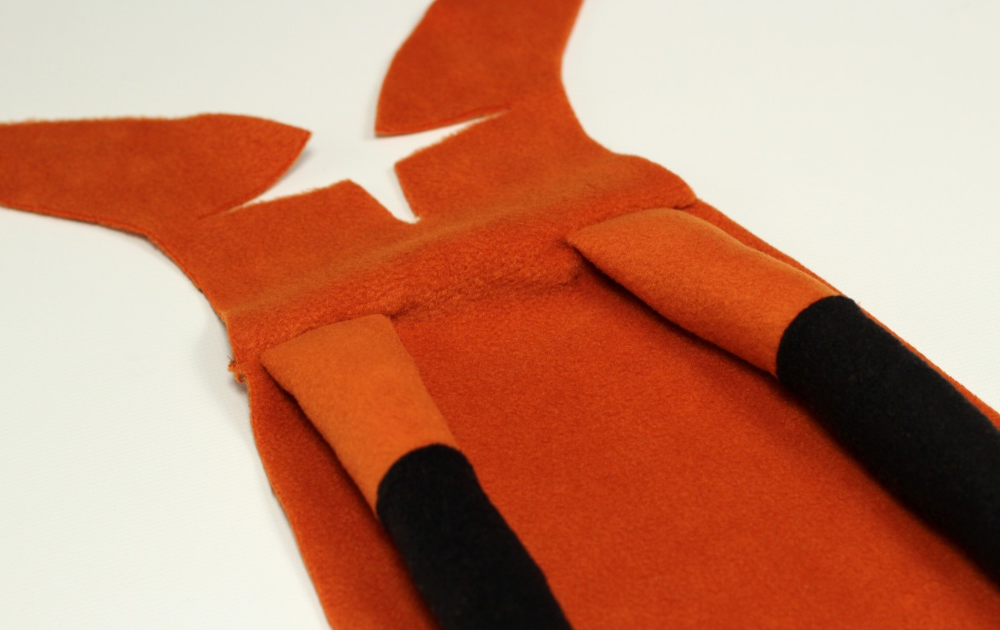

## Attach the ears

Attaching the ears is exactly the same as attaching the arms. Ensure that the ear tuck lies toward the center of the body piece and that the white fabric is face up, then stitch it in place the same way you did the arms. Depending on how far apart you want the ears to be, you may want to cut the ear holes a little deeper. Just make sure there is at least a 1/4 inch margin on either side of the ear.

When everything is attached, it should look like this:

## Sew the chest and face to the body

Position the edge of the chest and face piece we made in the beginning up with the edge of the fox body right sides together and pin it in place. The nose edges on the white and orange fabric must line up, and the neck seam should line up with the arm seam. If you line these two points up right, it doesn’t matter if the bottom edges don’t line up exactly.

Sew all the way down the edge of the body and repeat for the opposite side.

Pin the nose piece to the top edge of the face, right sides together. The curved edge should point toward the body. Remember this, and there is only one way to place this piece.

Sew the nose in place and repeat for the opposite side of the face.

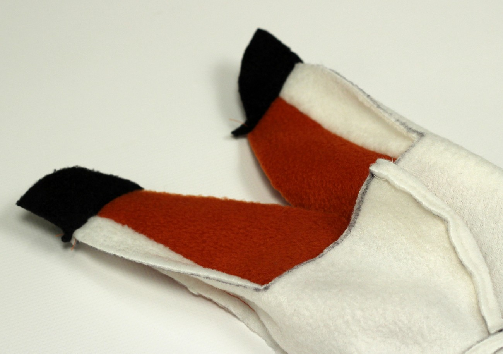

Finally, we can pin and sewing the head seam together. Make sure you pin the right sides together and line up the two ear seams. Sew all the way to the tip of the nose, but do not sew the short end of the nose piece, inside of the mouth opening.

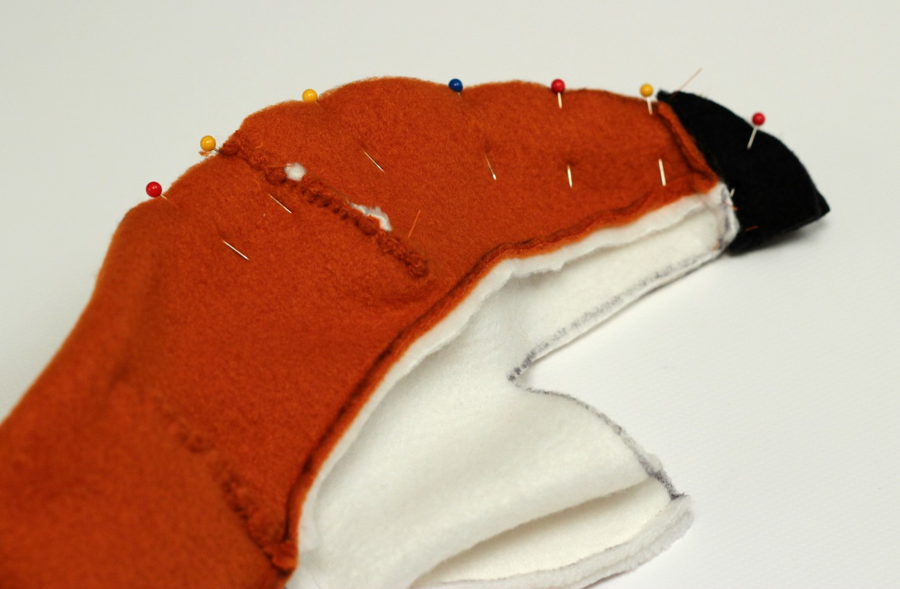

## Hand sew the felt mouth

You should now have a very strange looking inside out fox with a big gaping hole for a mouth. Gently pulling the tip of the nose and the chin to stretch the hole open, line up the face piece with the mouth piece, right sides together. Pin in place, tugging the cheeks out to the edge of the mouth piece.

Hand stitch the face to the mouth piece.

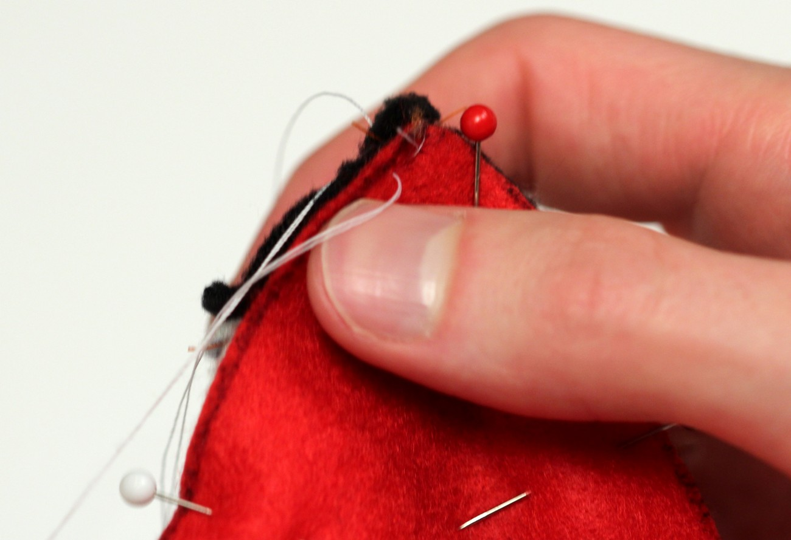

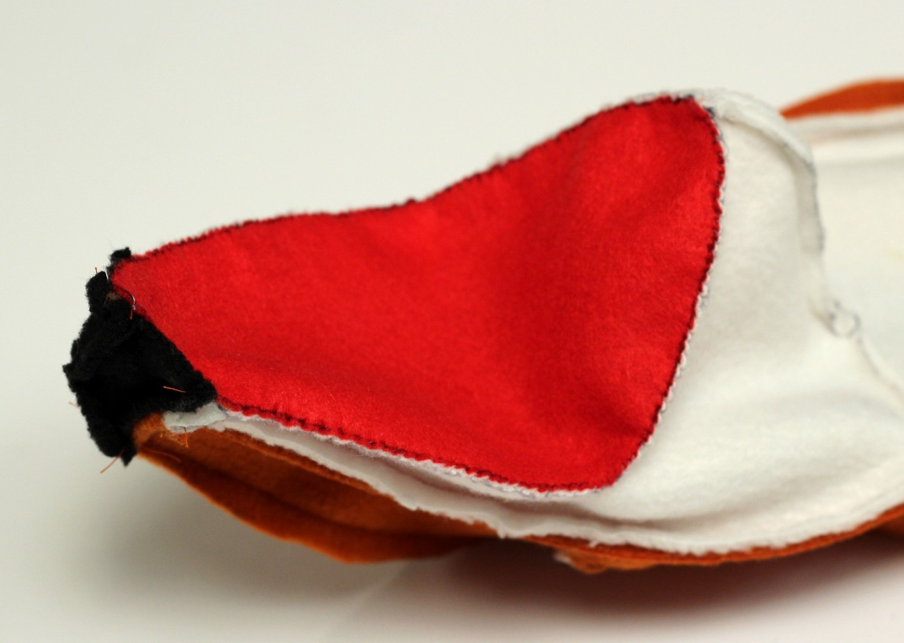

## Glue the mouth plate

To give the puppet face structure, we’ll glue the felt mouth plate to stiffened felt and foam sheeting. Start by making a glue guideline by centering the mouth pattern on the foam mouth piece and tracing it.

Following the directions on your fabric glue, glue the two stiffened felt mouth pieces to the foam.

Allow the stiffened felt/foam sheeting combo to dry before gluing the felt fox mouth to the stiffened felt pieces.

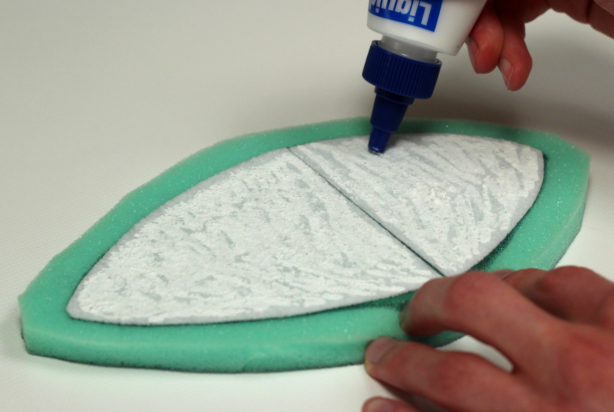

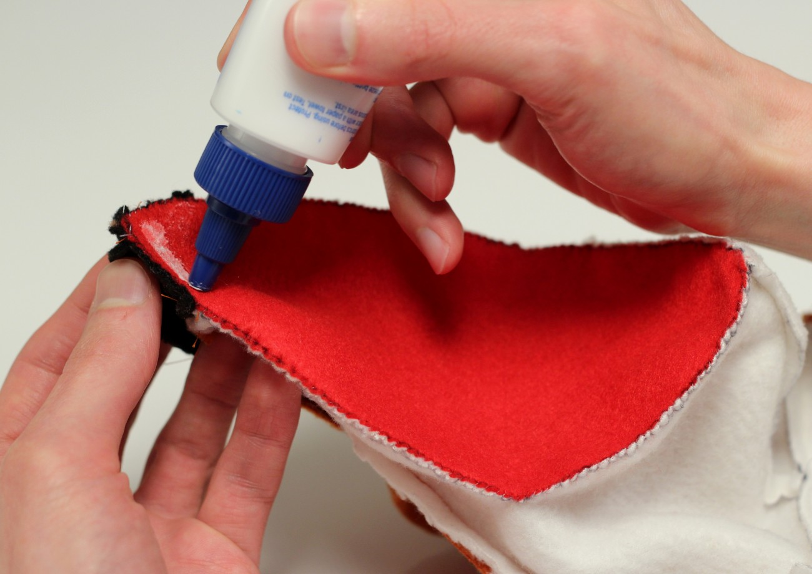

Press the fox mouth to the stiffened felt, tugging the edges to ensure no bubbles get trapped between layers.

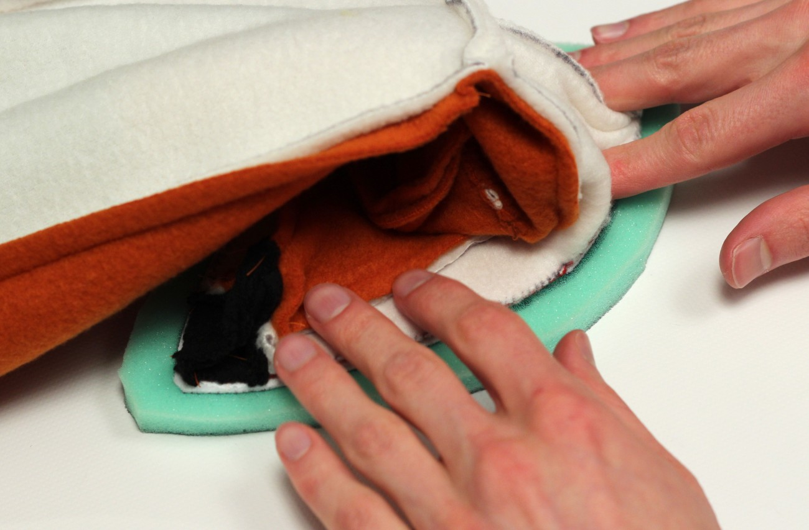

Once the glue has dried, you can turn your puppet right side out.

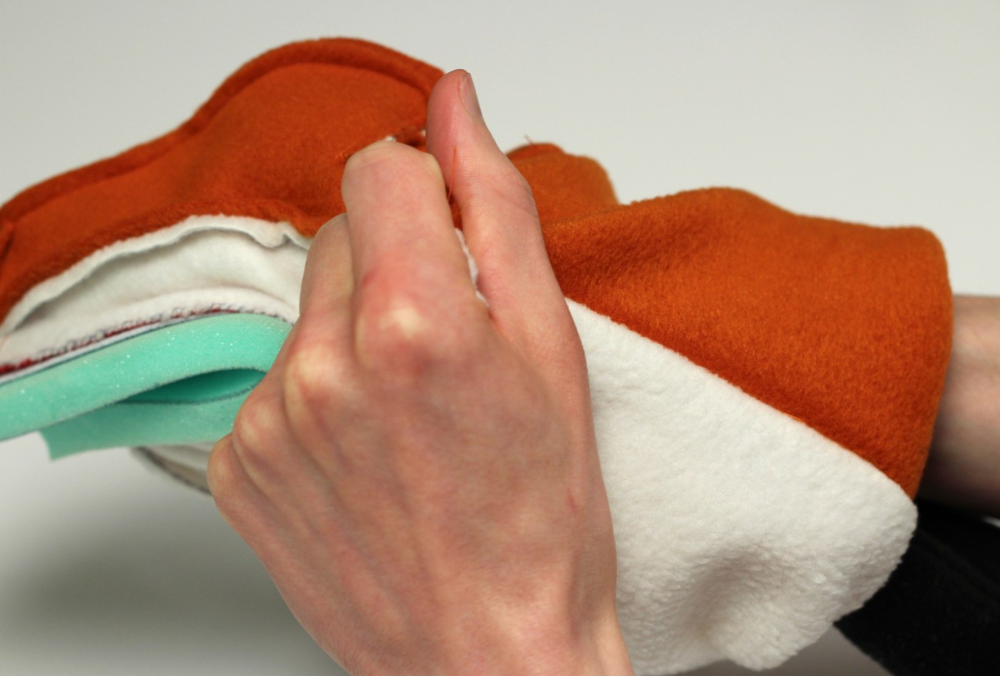

## Attaching the eyes

The only thing your puppet is missing now is eyes. You can use whatever buttons you like, and placement is entirely up to you. Try putting them in different spots until you find what you prefer, then glue or sew them in place.

Aww, so cute! Now, who wants to learn some HTML?

<iframe allow="accelerometer; autoplay; encrypted-media; gyroscope; picture-in-picture" allowfullscreen="" class="arve-iframe fitvidsignore" frameborder="0" name="" sandbox="allow-scripts allow-same-origin allow-presentation allow-popups" scrolling="no" src="https://www.youtube-nocookie.com/embed/-OHaDnuP1nM?iv_load_policy=3&amp;modestbranding=1&amp;rel=0&amp;autohide=1&amp;playsinline=1&amp;autoplay=0" width="480" height="270"></iframe>

