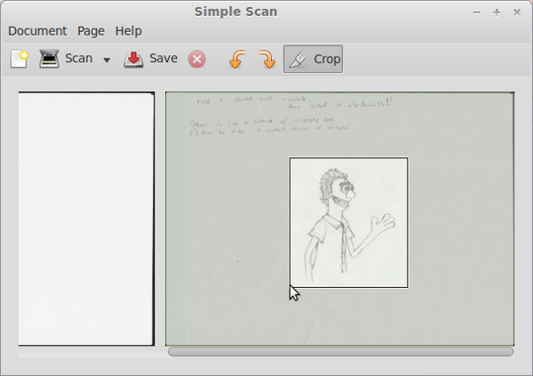
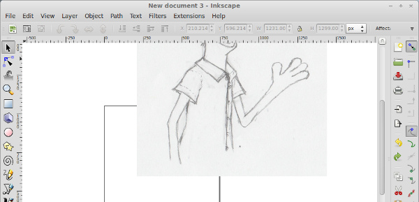

Today I want to teach you how to make the stylish cartoon character drawings you see on the Hello World Program website. This technique can be used to transform any boring picture into a luscious, colorful cartoon. We’ll be using a free and open source program called Inkscape to achieve the effect, but first we need to break out an old fashioned pencil and paper to do a few sketches. I decided to draw myself, but you could draw anything you want. It might be fun to draw a pet or a monster. Or a pet monster. Don’t be discouraged if your drawing doesn’t look right at first. I did many,

many drawings…

before I found the one that I liked.

If you can’t seem to draw something that you are happy with, take a break and try again later. You could also use a photograph instead of a drawing. That’s how I made the cartoon version of Unique ID.

Once you have a picture that you want to work with, we’ll need some way of getting that on your computer. A scanner would be perfect, and it is likely that your printer has one built into it. If you can easily lift the top of the printer and see some of the guts through a piece of glass, then your printer is also a scanner. If you don’t have a scanner, you could take a photograph of your drawing instead, but scanning is easier and looks nicer. For Linux users, I recommend a program called “Simple Scan” for this step. It is easy to use and is already installed on most Linux distributions. Place your drawing so that it is facing the glass on the scanner, and close the lid. Open simple scan and click the “Scan” button. The scanner may need a moment to warm up and will make loud mechanical noises for the next minute or two. When it finishes, you will see a picture of your scan in the Simple Scan window. This scanned the whole page, which we don’t need, so click on the “Crop” button and the program will guess which parts of your page are important, cutting out everything else. You can then adjust the crop area by clicking and dragging on any side of the crop box.

Click “Save” and choose a location on your computer that you can remember. Now it’s time to set up Inkscape. Inkscape is a graphics application for creating scalable vector graphics, which gives us the added benefit of being able to make our drawing any size without losing quality. By default, Inkscape will start with an A4 size canvas (the standard size for printer paper.) We can leave it like this for now because we can always change the canvas size later. The canvas is that white rectangle with a shadow behind it in the center of the screen. It is the visible part of your graphic. Anything outside of that square won’t be seen when you view your graphic outside of Inkscape.

In the menu at the top, click on “File” then “Import” and browse for the jpeg image of your scanned drawing.

When you find your drawing, select it and click “Open.” Inkscape will ask you if you want to link or embed the image. Embedding the image will make a copy of it inside of your graphic, which will make the graphic take up more space on your hard drive. Linking the image will tell Inkscape to look for the scanned image where you saved it, rather than make a copy of it. Embedding the image will save you trouble later if you move your file somewhere else. Click on the embed button.

Hey what’s going on? My picture didn’t even line up with the canvas!

Remember a few sentences back when I mentioned we could resize the canvas at any time? Maybe now is a good time to do that. Click on “File” then “Document Properties”. You will see a scary looking window with lots of little inputs to play with. About halfway down this window there is an arrow with some text next to it that says “Resize page to content.” Click on this, and then click on the button that says “Resize page to drawing or selection.”

Close the properties window. Look at the canvas! It’s sized perfectly for the pencil drawing. Before we start tracing our drawing, I find it helpful to make the pencil image slightly transparent. To do this we can edit the opacity (the degree to which something is see-through) of the layer that the drawing is on. Look for an icon on the right side of the program called “View Layers.” It looks like a bunch of papers stacked on top of each other. Click on this or press Control + Shift + L to open a panel that shows all of the layers of your graphic. Layers are like sheets of transparent paper that we can stack on top of each other and rearrange so that objects drawn on one layer appear behind objects drawn on another. I like to keep the pencil drawing on its own layer and put all of the black inking outlines on a different layer. You might need to expand the layers box to get a better view of your layers. To do this, hover over the bottom of the box until your mouse pointer changes into double arrows, then click and drag to resize the box. Now you can see we have lots of space for making layers, but right now we only have one called “Layer 1.”

If you’d like, you can change the name of the layer by clicking on the text and typing something like “Pencil Sketch,” then press Enter. In the same panel, drag the “Opacity” slider down until your pencil sketch is a dull gray color. I set mine at about 70%. Next to the layer name you will see two icons. The eyeball will show or hide that layer, and the Lock will change whether or not you can edit the layer. We don’t want to make any more changes to the pencil sketch layer, so click on the Lock icon. Now click on the green plus button to add a new layer. Type “Outline” for the Layer Name, leave the Position as “Above Current,” and click “Add.” Everything is finally in place and we can move on to the next step. It’s a good idea to save often, so go ahead and save your graphic now.

In part two of this tutorial, we’ll cover [inking in Inkscape with the calligraphy and tweak tools](/inking-in-inkscape-with-the-calligraphy-and-tweak-tools/ "Inking in Inkscape with the Calligraphy and Tweak Tools").
