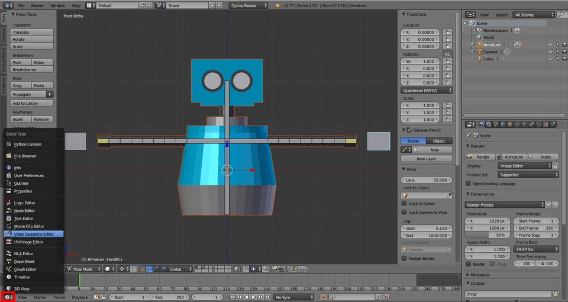
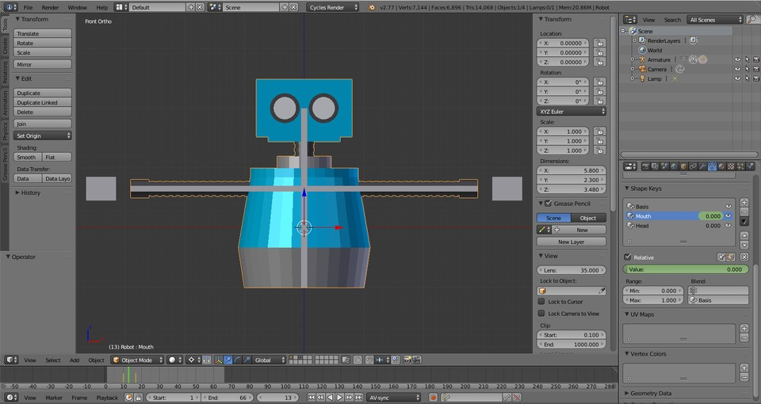
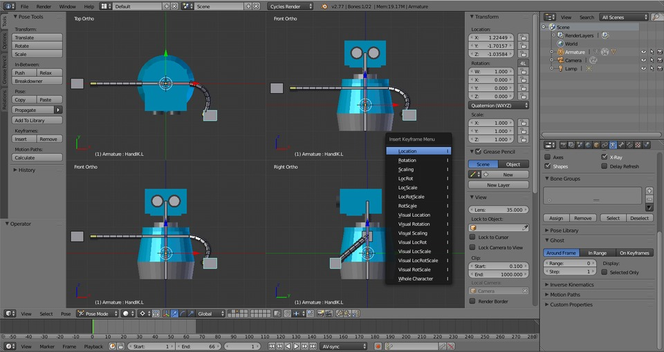

In this chapter, you will learn how to key frame a Blender animation by adding an audio file to your project and syncing your robot’s movements to the sound.

you’re just joining us, you will want to start with [Part 1, Beginner Blender Tutorial: How to Model & Animate a Robot.](/beginner-blender-tutorial-how-to-model-and-animate-a-robot/)

  

In the Properties panel under Render, set the Frame Rate to 29.97.

In the Timeline panel, select and switch to the Video Sequence Editor.

From the Video Sequence Editor menu, click Add and select Sound. This will prompt you to open a sound file. Select [hello_world.wav](./hello_world.wav).

Position the cursor at the end of the sound clip.

Then switch back from the Video Sequence Editor to the Timeline.

Change the length of the animation to match the position of the cursor (66).

**Shift + LEFT** to move the cursor to the beginning of the Timeline. In the Timeline, click the Playback menu and check Audio Scrubbing and AV Sync.

Press **ALT + A** to play. Hello World!

## Key Frame a Blender Animation

**RMB** to select the robot mesh. In the Properties panel, select Object Data.

Press **RIGHT** until you hear the first bite of audio (11). Then move back one frame (10). Under Shape Keys, select Mouth. Hover your mouse over the Value slider and press **I** to insert a key frame.  

**RIGHT** to find end of first syllable (‘hell’, 17), and hover your mouse in the Value field and press **I**, then skip back to find the ‘peak’ of ‘hell’ (13).

Set Value slider to 1, and press **I** to insert a key frame.  

Press **UP** to jump to the last key frame, then **RIGHT** to find end of ‘hello’ (39). Press **I** to insert a key frame.

**LEFT** to find ‘peak’ of ‘o’ (30), set Value to 1 and press **I** to insert a key frame.

Press **UP** to jump to the last key frame and **RIGHT** to the end of ‘World’ (52). Press **I** to insert a key frame.

Press **LEFT** to find the ‘peak’ of ‘World!’ (45), set the Value to 1 and insert a key frame with **I**.

**SHIFT + LEFT** to jump to the beginning of the Timeline. Then press **ALT + A** to play. Hello World!

Press **ALT + A** to pause.

Switch to Quad View with **CTRL + ALT + Q**.

If you’re not already at the beginning of the Timeline, press **SHIFT + LEFT** to get there.  
****

Our robot is a bit stiff with its arms out. To start our animation, let’s put the arms in a more relaxed position. **RMB** HandIK.L, then press **G** to Grab and move it around. Use the different views as needed to position it as above. The press **I** and select Location.

Alternatively, you can hover the mouse of the Location in the Transform panel, and press **I**.

**RMB** HandIK.R and press **G** to Grab it and move its position. Press **I** and select Location.  

Move the Timeline to 30\. Press **G** to Grab and move the arm up. Press **I** and select Location.

**RMB** HandIK.L Press **I** and select Location, then move to frame 50 in the Timeline. Press **G** to Grab and move the arm up. Then press **I** and select Location.

Press **SHIFT + LEFT** to jump to the beginning of the Timeline and **ALT + A** to play.

Hello World!
