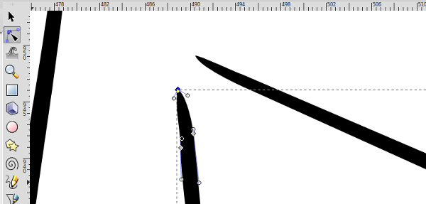

Inking is the process of turning a boring old pencil drawing into a luscious black and white cartoon. Traditionally this is done with pen and ink, hence the term inking. We’re going to take inking into the digital realm with Inkscape. You should have an Inkscape document sized to your drawing that has two layers: one for you pencil sketch and a blank one for your outlines. If you don’t have this, you should read the post on [how to set up Inkscape for inking](https://dototot.com/how-to-make-cartoon-drawings-with-inkscape/ "How to Make Cartoon Drawings with Inkscape") before you continue.

There are a few different approaches to inking. For an image with lots of straight lines, you might find it easier to use the pen tool. For more organic images, such as a picture of yourself, the Calligraphy tool will be easier to use and look nicer too. I’m kind of organic, so I’m going to use the calligraphy tool. Click on the calligraphy icon on the left or press Ctrl + F6 to select the tool. A row of options will appear at the top of the program. These determine what our brush strokes will look like. The width changes how thick the lines will be. Even though we want to end up with some chunky lines, the width should be set to three. We will thicken the lines later, so this is a good starting point. Thinning, angle, and fixation change the shape of the brush. You can play with these settings to see what they do, but for inking they should all be set to zero. Tremor and wiggle will do crazy things to your pen strokes. Crank up the settings on these to see what I mean.

That’s awesome… but not very useful. For now they should be set to zero. The last option, mass, will slow down the speed of the pen strokes on screen. The higher the mass is set, the more your pen strokes will lag behind the mouse cursor. This is useful for tracing difficult parts of your drawing. Play around with the mass to find something that is comfortable for you. I find that something around twelve feels pretty good.

Now we are ready to start tracing. A graphics tablet can make this step easier, but a mouse will also work. First we need to zoom way, way in to the drawing. You can either use the zoom tool from the tool bar on the left, or if your mouse has a scroll wheel, it is much easier to hold the control key and scroll forward and backward to zoom in and out.

Make sure the outline layer is selected, and start tracing your drawing. If you are having trouble staying on the lines, play with the mass setting and try zooming in more. It doesn’t have to be perfect; it’s okay to have wiggly lines. Try to make your strokes long and smooth. Each time you lift the pen or release the mouse button, a new line object is made on your outlines layer. Lots of little pen marks means lots of little objects that can be difficult to work with in the next steps. If you mess up at any time, you can press Ctrl + Z to undo, or use the selection tool (the black arrow) to pick and delete specific line objects.

Continue tracing all of your pencil lines. You can hide the pencil layer by clicking the eye in the layers panel at any time to get a better idea of what your drawing looks like.

Once you have traced all of the lines in your drawing, we can begin tweaking them to make them look more interesting. Select the tweak tool on the left (the one that looks like a wave) or press Shift + F2\. The tweak tool is used to change the appearance of objects on the canvas. We’ll need to adjust some of the settings at the top. The width changes the size of the area that the tweak brush will affect, and force changes how strong the effect is. For our line drawing, a width around six and a force of about three will work well. There are several effects you can apply with the tweak tool that you may want to play with. We want to make our lines thicker, so the effect we need is called “Shrink.” Wait.. what? Yeah, you heard me right, look for the icon that looks like two lines pinching together and click on that. The default effect of the shrink tool is to draw the edges of an object together; making the line thinner. If you hold the shift key while using the brush, it changes the behavior to push the edges away from each other, which makes your line objects thicker. The last option, fidelity, will change how much detail is preserved when you apply the effect. A very low or very high number will distort the drawing, so I keep mine set around 50.

The tweak effect will only be applied to the current object selected. So rather than select each individual piece and apply the effect, we can temporarily group all of the objects together. To do this, choose the select tool from the left (or press F1) and press Ctrl + A to select everything on the outlines layer. Press Ctrl + G or go to “Object” then “Group” in the menu at the top. Now Inkscape will treat all of your lines like one big object.

Switch back to the tweak tool (you can press Ctrl + F2 as a shortcut) and begin gently painting over your lines anywhere you want them to be thicker. Don’t forget to hold the shift key down while you use the brush! The effect may be subtle at first, but keep painting over the spot you want to get thicker and you will start to see the line take shape.

If there is a spot with a lot of small detail that you want to adjust without affecting nearby lines, you can un-group your lines by choosing the select tool, clicking on your outline object, and pressing Ctrl + Shift + G. Then you can select only the line you want to work with and switch back to the tweak tool.

If you find that the tweak tool is making huge sections of your line disappear, you may need to play with the width, force, or fidelity settings. Start by adjusting the fidelity. A lower fidelity can be useful for smoothing out very wiggly lines, but it can over-simplify your drawing to the point that it vanishes. It’s okay if the ends of your lines shrink in on themselves, leaving small gaps at the beginning and ending of lines. We can fix that later. Just try to set the brush so that it doesn’t erase portions in the middle of your lines.

Keep painting over your lines until you are satisfied with the result. Now would be a good time to review your drawing and make any adjustments. I didn’t like the hand on my pencil drawing, so I drew a new one in Inkscape. If you’re happy with everything so far, we can move on to closing up the gaps introduced by the tweak tool. For this we’ll use the path edit tool. Click on the icon just below the black arrow or press F2 to select the path editor. Now when you click on any of your lines you will see lots of little gray diamonds along the edges. These are the points that make up the shape of your line, so try grabbing one and moving it. When you select a point, two circles will appear next to it connected by a blue line. These change the curvature of the line on either side of the current point. You can also press delete to remove a point entirely. Using these techniques, zoom in dangerously close to any gaps in your drawing and adjust the points so that the lines are touching again.

When you’ve finished closing the gaps, zoom out and admire your handiwork. Here’s what my finished outlines look like. How did yours turn out?

Pretty cool, right? We’re all done with inking, so save your project and treat yourself to a glass of lemonade! If you’d like to add some color to your drawing, you’ll definitely want to read the next step on [coloring in Inkscape](https://dototot.com/coloring-in-inkscape/ "Coloring in Inkscape").
