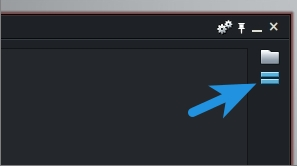
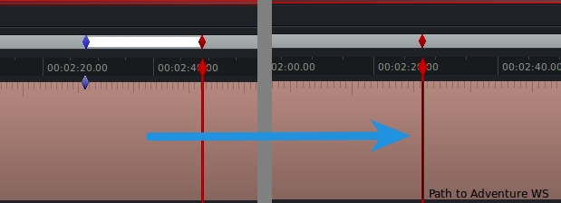

Now that you know [how to set up a Lightworks project](/setting-up-your-first-lightworks-project/ "Setting Up Your First Lightworks Project") and have mastered [importing video, JKL playback, and setting cue points](/editing-lightworks-import-playback-cue-points/ "Editing with Lightworks: Import, Playback, and Cue Points"), it’s time to get serious about editing. While there is a general process to editing, there are no hard and fast rules. My approach may be much different than your approach, but generally your edit will need to go through multiple phases before it is considered complete. The first edit, known as an assembly edit, is a rough assemblage of scenes and best takes with no music or effects added. Your edit is then further refined as a rough cut, then a fine cut, and finally a lock cut. Today we’ll focus on making an assembly edit, so we can quickly get results as we get comfortable with the Lightworks toolset.

One of the most exciting and intimidating parts of editing is making the first cut. You’ve watched all of your footage, and you know which takes you like, but what should you drop in first? This will change depending on the format of your show, but generally I like to start by laying down a wide shot, then cutting in close ups as they are needed. So lets do that now. If you don’t have videos of your own to work with, you can download these [Path To Adventure Video Assets](./path_to_adventure_video.tar.gz) and follow along.

To briefly recap an important note from [the previous tutorial](/editing-lightworks-import-playback-cue-points/ "Editing with Lightworks: Import, Playback, and Cue Points"), remember that source monitors are outlined in blue and your destination monitor is outlined in red. You only have one destination monitor, which is attached to a timeline. The timeline is where you will cut in footage from your source monitors.

If for some reason you do not see your timeline, click the “show timeline” button on the right side of the destination monitor.

You can have multiple source monitors open at any time, but you’ll only copy content to the timeline from the source monitor that is active. To make a monitor active, simply click anywhere on it. You can easily tell which monitor is active because its outline will be brighter than all of the other monitors.

While it is possible to drag and drop an entire piece of footage from one of your bins onto your timeline, you’d end up with a whole lot of excess footage that would be cumbersome to trim. This is why we should first load our wide shot in a source monitor and mark only the part we want to keep with in and out points. Using the JKL playback controls, find your beginning mark and hit the “i” key to place an in point. This will drop a little blue diamond on the source monitor’s timeline.

Now scrub ahead to where you want the wide shot to end, and simply leave your playhead there. You’ve just mastered a key Lightworks concept called “mark and park”. You see, it’s possible to place an out point by pressing the “o” key, but if there is no out point set, Lightworks will assume that the playhead is your desired out point. It’s a nifty little time saver, but if you have used any other video editor before, setting an out point is a difficult habit to break. No worries, because there’s nothing wrong with marking an in and an out, it’s just redundant. If both an in and an out point are set, Lightworks will ignore the position of the playhead. This is actually somewhat useful for those occasions where you have roughly marked an in and out but want to go back and fine tune them before cutting to your edit timeline.

Speaking of which, there are a two options to get our freshly marked piece of footage onto our main timeline: insert and replace edits. With nothing currently on our timeline, it doesn’t matter which method we use, so I won’t bore you with those details yet. For now, simply hit the “b” key to perform a replace edit. We’ll come back to these in a moment, I promise.

Awesome, your first edit! Unfortunately, if you followed my lead, then you’ve made a horrible mistake! There’s a bit of a blooper somewhere near the end of this take. Unique ID seems to lose his balance, and then Adelie… well, I don’t know what Adelie is doing.

We could have avoided this by marking and inserting two clips independently from our source monitor. It’s not a big deal, though. We can very easily remove it from our timeline with the mark and park technique. Set an in point just before ID is about to take a dive, then scrub ahead to just after Adelie finishes… whatever it was she was up to. Now press the “x” button to extract everything within the marked range, collapsing the edit as it does so.

Jump back to the beginning of the edit by pressing the “h” key, and play through until Adelie’s first squawk. I’d like to emphasize her enthusiasm for going on an adventure, so here would be a good place to cut in a close up. Position your playhead just before the squawk by using the left and right arrow keys, or by holding the “k” key and tapping “J” or “l” to move one frame at a time. Load Adelie’s close up in your source monitor and mark a clip that includes her first two responses to Unique ID. Last time we cut footage onto our timeline, we used a replace edit, so lets try something new. This time hit the “v” key to perform an insert edit.

An insert edit creates an empty cut on your timeline, then pushes the two clips apart to accommodate your new piece of footage. In other words, nothing is overwritten or replaced, but the new footage is inserted wherever your playhead is set. That means we have Adelie’s lines repeated in the wide shot after the close up that we just cut in. You can probably guess that we should have used a replace edit. Press the tilde key to undo our insert edit, then press “b” to perform a replace edit.

A replace edit overwrites whatever was in your timeline with the clip from your source monitor. The timing should work out such that you don’t have to delete or add anything to the wide shot to keep in line with the pacing of the close up. That is, you don’t have to do that _yet_. Once we’ve finished our assembly edit, we’ll want to go back through and fine tune our edits. For now, you know everything you need to finish the assembly edit. When you are ready to take your editing to the next level, head on over to the [advanced trimming tutorial](/lightworks-video-editing-advanced-trimming-techniques/ "Lightworks Video Editing: Advanced Trimming Techniques").
