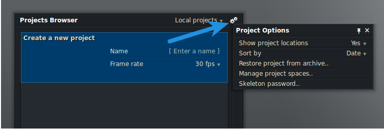
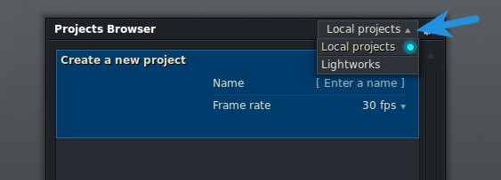
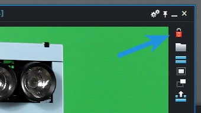

By default, Lightworks saves all of your projects in the “Lightworks/Projects” folder found in your home directory. With a Lightworks Pro license, you are given more control over your project spaces, allowing any location for your projects. This is useful if you want to consolidate all of your projects on a drive other than the one on which your operating system resides. I like to edit all of my Lightworks projects directly off of an external USB 3.0 hard drive because it keeps my media organized and allows me to be productive at any work station. While setting this up is not difficult, it isn’t immediately obvious how to accomplish it from the Lightworks interface.

Once you have loaded Lightworks, click on the cogs icon in the top right corner of the project browser, then click on “Manage project spaces…”.

This will pop up the “Manage Project Spaces” dialogue. From here you can change the location of your local and shared projects.

If all you want to do is move your projects to another location on your internal hard drive, you should edit the “Local Projects” location. If you are setting up a network drive or an external hard drive, add the location of the that drive in the shared projects location field. You will also need to create a new project space. This will create a sub-folder inside of the location you specified as your shared projects location that will contain all of your Lightworks projects. You can name the project space anything you want. I simply called mine “Lightworks”.

Close this dialogue and go back to the project browser. There should now be a drop-down indicator next to “Local Projects” in the top right corner. Click this and select your new project space.

That’s all it takes! Lightworks will always try to load the last project space you used when you restart the program, but if it can’t find it, it will default to your local projects. If you intend to edit videos on multiple computers, you will need to be aware of edit permissions. When you create an edit in a shared project, you will now see a small padlock icon in the top right corner of the monitor. When this is green, it means that the edit belongs to you, so you can make changes to it.

If you simply plug your hard drive into another computer you won’t be able to make edits to your timeline, because the edit still belongs to the user of the first computer.

You would first need to unlock the edit with the original owner to be able to make changes. You can unlock an edit by clicking on the padlock and selecting “No Owner”. Then on your other machine, you would need to switch the owner of the edit back to yourself. If you forgot to do this and are stuck with a locked edit, you will need to make a copy of that edit by clicking the “Make Copy” button on the side of the monitor.

