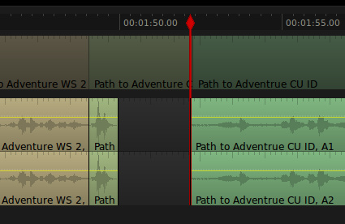
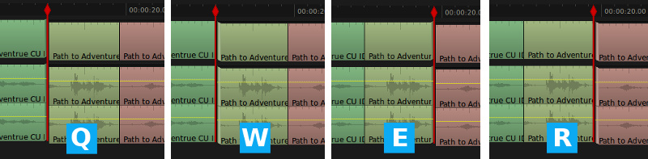
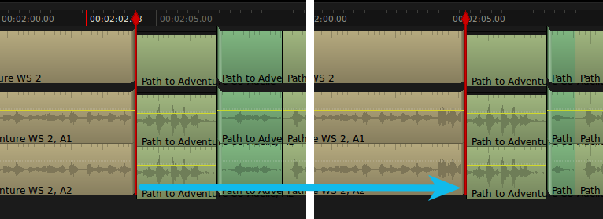
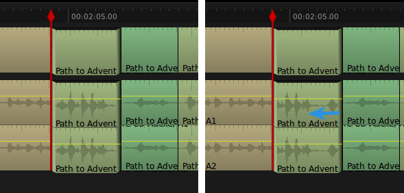

If you followed the [basic timeline editing tutorial](/lightworks-editing-basic-timeline-edits/ "Lightworks Video Editing: Basic Timeline Edits"), you should now have a very rough assemblage of clips on your Lightworks timeline. When creating an assembly edit, it’s best to cut for audio and not be too concerned about how the video looks. This also makes sense if you are following the general editing rule to only cut when new information is presented. A change in speaker is certainly new information, but sometimes a character’s reaction is even more important, and we don’t need to see the speaker at all. Not to mention hard cuts between each line of dialogue is rather disorienting, predictable, and frankly quite boring. It’s nothing a bit of advanced trimming can’t fix.

Unless the film stylistically calls for an editing approach that celebrates the involvement of an editor, the goal is to be as invisible as possible. There are several techniques for “softening” a cut to make them less noticeable. Two very powerful techniques are J and L cuts. With a J-cut, we hear the sound from a clip before we see it. An L-cut is just the opposite; we see a clip before we hear the audio. So really, it’s one technique that is mirrored. To understand the naming convention for these cuts, it’s best to see how they look on a timeline.

This slight overlapping of video and audio helps our brain cope with the edit. We hear the audio and subconsciously prepare ourselves for the cut. Alternatively, we see the new character and prepare for the speaker to change. Not only does this make our editing more transparent, it allows us to reveal the reactions of our characters to the conversation. Because our assembly edit has the audio positioned more or less where we want it, we’ll leave that alone and only move the video split to create a J-cut. Position the playhead on the cut that you want to adjust (remember that you can use the A and S keys to snap the playhead to cut points). Now tap the U key.

See how the clips seem to fold into the cut? That’s Lightworks subtly telling you that it is going to add footage to the left side and take it away from the right side, essentially moving the cut point. But wait! We only wanted to move the video cut, not the audio cut. Lightworks will try to apply whatever trim command you give it to any active layers, so if we only want to move the video cut, we need to first disable the audio track. Press Tab to rejoin the edit and disable trim mode, then turn off the audio track by clicking on the label to the left of the timeline. You could also press the corresponding number on your keyboard to disable the track, 1 being you video track and 3 being the audio track (2 doesn’t count because it’s a stereo track).

With the audio track disabled, press U again. Using J/K/L playback, we can freely move the cut anywhere we want and our video will remain in sync with our audio. The video monitor will expand to show you the last frame of the clip to the left and the first frame of the clip to the right.

To make precise adjustments, you can use the comma and period keys to move the cut one frame at a time, and the M and forward slash keys to move ten frames at a time. Alternatively, you can use the J/K/L trick we learned last time and hold the K key while tapping J or L to move one frame at a time. When you are satisfied with the cut, press the Tab key to rejoin the footage.

When I edit dialogue, I tend to error on the side of cutting it too fast. I’d rather have my characters practically talking over each other than allow any pauses to creep in. It’s not really a natural way to converse. Nobody is that quick on the draw. Well, okay… I’m not that quick, but it makes the conversation much more engaging when the back and forth is almost instantaneous. For my tastes, the L-cut we just made takes a little too long for ID to respond. If we had trimmed the clip before we did the L-cut, we could have simply set in and out points, then cut the dead space out of the timeline.

I’m sure you can see the problem with attempting this now. We’re going to end up creating a very nasty jump cut in our video. Never fear, there’s a trimming function for just such a situation. With the video and audio tracks enabled, place the playhead on the video cut and press the W key.

As you can see from the fold, Lightworks has unjoined the footage to the right of the cut. Try playing the video forward a few frames to tighten up the edit, then press Tab to commit the change.

We shouldn’t get too carried away with removing pauses. Sometimes we need a moment of silence to drive home a dramatic or comedic point. We can even fake a long pause by extending the end of one clip and the beginning of the next clip as much as possible. Here I want to give ID some time to think about what Adelie just said, so I’ll put the playhead on the edit and hit the Q key. This tells Lightwork to unjoin the end of the previous clip.

Play forward a bit to add some frames to the end of the clip. Join the edit and use the W key to add frames to the beginning of the next clip.

Because we are artificially increasing this pause, we have pulled in unwanted audio. We could disable the video track, set an in and out point on the audio timeline, then lift the unwanted clip, but lets use this opportunity to learn a new trick. Disable the video track and hover over the beginning of the audio clip until you see a little graphic next to your mouse that looks like a “C”. Holding the control key, click and drag the edge of the clip over to replace the audio with blank space.

I don’t often recommend using the mouse, in fact I would have done this edit with the keyboard method I described, but I wanted to introduce you to the mouse controls because they can be useful if you forget the keyboard shortcuts. All of the trim modes we’ve covered can be accessed with a click of the mouse. The trim icon will change depending on where you hover, giving you a pretty good indication of how it is going to affect your clips. It’s a nice feature to have, but if you can get comfortable with the keyboard you’ll be much quicker. All of the keyboard shortcuts for trimming are located between the letters Q and U. If you do forget what each letter does, there’s no harm in randomly hitting those keys until you find the one you want. I often forget the shortcuts, even though the layout is fairly logical. From left to right, Q unjoins the the end of the previous clip, W unjoins the beginning of the current clip, E unjoins the end of the current clip, and R unjoins the beginning of the next clip.

We already covered moving a cut with the U key, so that only leaves T and Y. T performs a slide edit by unjoining the end of the previous clip and the beginning of the next clip. A slide edit lets you move an entire clip through your timeline, adjusting the length of the clips on either side of it to compensate.

The Y key initiates a slip edit by unjoining the beginning and end of the current clip. Slip edits allow you to change the in and out point of a clip without modifying its length. It’s a little confusing the first time you do it, so imagine a strip of film being passed beneath a small window. The edges of the window are your in and out points. A slip edit rolls the film by, changing what appears within the window but not the size or position of the window. That may have been equally confusing, if so please disregard.

With these trimming tools, you are well prepared to finish a fine cut of your edit. Every editor must develop their own style, so I won’t tell you how to work your magic, but I will give you a few suggestions.

1.  **Match actions:** You can “hide” an edit by cutting in the middle of an action, such as a head turning or a fist landing its mark on a face. The easiest way to time this properly is to line up the edit on the end of the action, then roll the cut backward several frames.
2.  **Watch the eyes:** Let your character’s eyes direct your cutting. If you are trying to cut away from a character, look for movement in her eyes. If she turns to look at something, cut away as soon as she has locked eyes with her target. Even cutting on subtle eye movements can make your film less jarring.
3.  **Know when to hold a shot:** Don’t get overzealous with your cutting. Sometimes we learn more about a character by watching how he reacts to his partner.
4.  **Be ruthless:** Trim, trim, trim. The tighter edit is, the better it flows. Can you trim a few frames here? One frame there? Every single frame counts.
5.  **Don’t get too attached:** Never be afraid to cut bits that you love if it improves the overall project.

Most importantly, have fun! There’s no shame in scrubbing the playhead back and forth to make your actors dance. I do it all the time.
