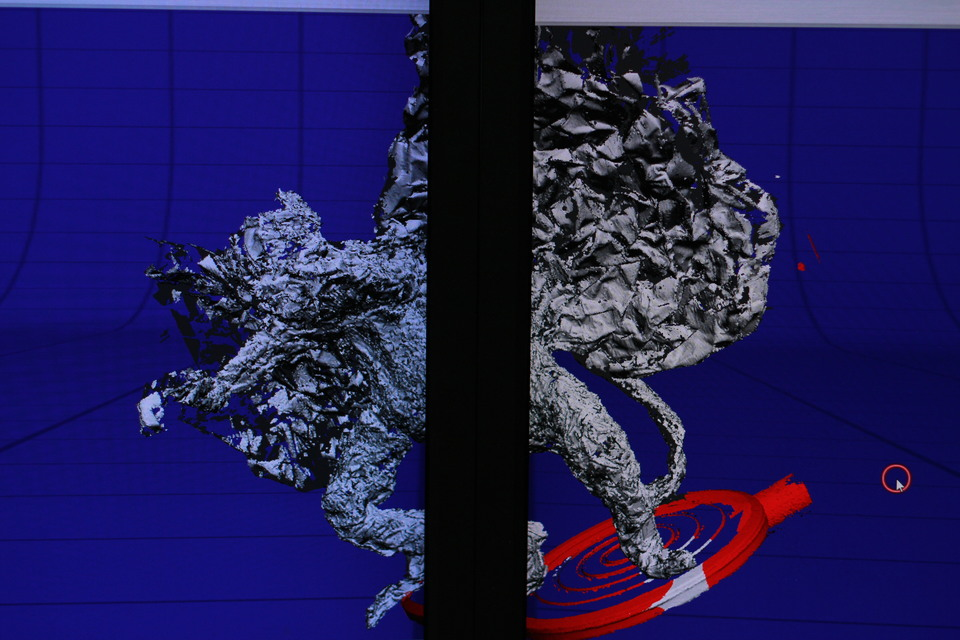

We grew up with a VCR and a stack of film classics on magnetic tape viewed so many times no amount of tracking would cure the noise. One of those VHS cassettes was the 1939 adaptation of L. Frank Baum’s _The Wizard of Oz_, which we used as inspiration for the Hello World Program episode, [“What’s an Operating System?”](https://youtu.be/lXMSfGwq9cE). If you recall from the book or the film, the Wicked Witch of the West sends a flock of flying monkeys to interrupt the course of Dorothy and her traveling companions. For us, as kids, the flying monkeys were frightening. We wanted to achieve the same effect with our flying code monkeys in this episode, but not spend too much time crafting characters that would only make a brief appearance on screen. We struck gold in tinfoil. Eureka!

<iframe allow="accelerometer; autoplay; encrypted-media; gyroscope; picture-in-picture" allowfullscreen="" class="arve-iframe fitvidsignore" name="" sandbox="allow-scripts allow-same-origin allow-presentation allow-popups" scrolling="no" src="https://www.youtube-nocookie.com/embed/lXMSfGwq9cE?iv_load_policy=3&amp;modestbranding=1&amp;rel=0&amp;autohide=1&amp;playsinline=1&amp;autoplay=0" width="480" height="270" frameborder="0"></iframe>

I [moonlight at the Fablab at the Martin Luther King, Jr. branch of the DC Public Library](https://www.washingtonpost.com/lifestyle/magazine/as-libraries-embrace-maker-rooms-are-the-poorest-users-being-left-behind/2016/03/30/49a0a530-db50-11e5-891a-4ed04f4213e8_story.html?tid=a_inl), which, in addition to a laser cutter and 3D printers, provides me access to a 3D scanning station. One afternoon in January, we took up residency in the [Fablab](https://dclibrary.org/labs/fablab) and brought our flying code monkey to life.

## Making Flying Code Monkeys

First, we sculpted the monkey from tinfoil.

The we scanned it, using the NextEngine scanner, and exported the scan as an .stl.

  
I then imported the .stl into Blender and added a simple armature for rigging. All of the above steps were relatively quick and easy. What I didn’t anticipate taking so long was weight painting, but in retrospect it makes sense. There are a lot of faces on this monkey. The crinkled texture of the tinfoil created an inordinate number of polygons, even after several iterations of simplification in NextEngine.

  
Once the weight painting was complete, I animated the wings flapping and a simple ‘walk cycle’. I then made a few dozen copies, randomly offset their keyframes so they wouldn’t be flapping in unison, and “Voila!” A flock of flying code monkeys. See them in action in the video below…

<iframe allow="accelerometer; autoplay; encrypted-media; gyroscope; picture-in-picture" allowfullscreen="" class="arve-iframe fitvidsignore" name="" sandbox="allow-scripts allow-same-origin allow-presentation allow-popups" scrolling="no" src="https://www.youtube-nocookie.com/embed/lXMSfGwq9cE?iv_load_policy=3&amp;modestbranding=1&amp;rel=0&amp;autohide=1&amp;playsinline=1&amp;autoplay=0" width="480" height="270" frameborder="0"></iframe>

